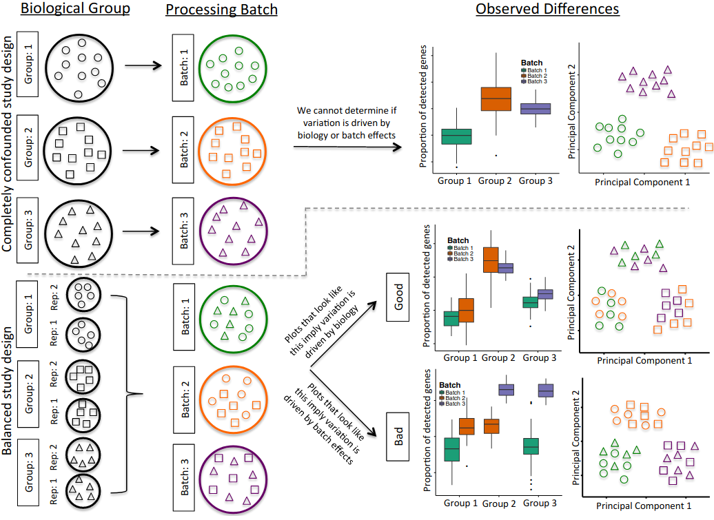

### Experimental Setup
Perhaps one of the most central aspects of scRNAseq studies in the study design. In the opinion of this instructor, the study design is the most fundamental aspect of scRNAseq experiments. One of the reasons for stringent study design are technical variability. Technical variability can give rise to varying cell capture efficiencies, varying library quality, batch effects due to underlying biology or even experimental handling and amplification bias due to chemistry or transcript. This highlights the problem of confounding. When an external factor distorts the effect and leads to a mixing of effects between the treatment and control we term that phenomena as confounding. Confounding can predominnatly be attributed to batch effects and inappropriately designed experiments. This is highlighted in the figure below:

Figure adapted from [Hicks et al., 2018: Biostatistics](https://academic.oup.com/biostatistics/article/19/4/562/4599254)

----

[Just the Docs]: https://just-the-docs.github.io/just-the-docs/
[GitHub Pages]: https://docs.github.com/en/pages
[README]: https://github.com/just-the-docs/just-the-docs-template/blob/main/README.md
[Jekyll]: https://jekyllrb.com
[GitHub Pages / Actions workflow]: https://github.blog/changelog/2022-07-27-github-pages-custom-github-actions-workflows-beta/
[use this template]: https://github.com/just-the-docs/just-the-docs-template/generate
