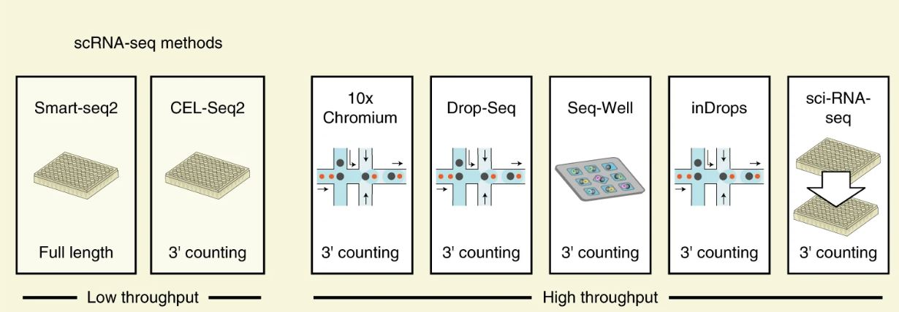
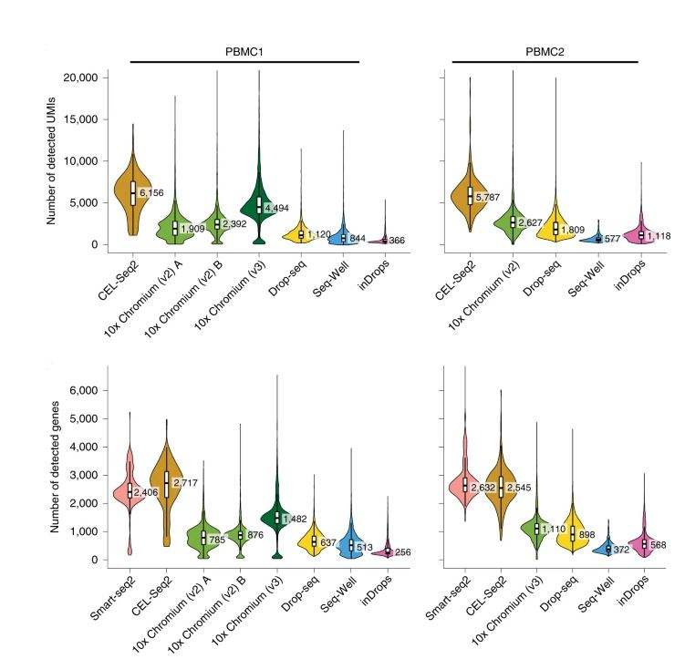

## Library Preperation
Library preperation involves the creation of a partitioned single cell library which allows for the sequencing of RNA transcripts (cDNA) in tandem across multiple single cells. The modality for library prep is an important consideration as it drives overall sequencing quality. Nevertheless most appropriate library/sequencing platform depends on the biological question. For example, if one is interested in characterizing the composition of a heterogeneous tissue, then a droplet-based method is more appropriate, as it allows a very large number of cells to be captured in a mostly unbiased manner. On the other hand, if one is interested in characterizing a specific cell-population for which there is a known surface marker, then it is probably best to enrich using FACS and then sequence a smaller number of cells at higher sequencing depth.

Figure adapted from [Ding et al., 2020: Nature Biotechnology](https://www.nature.com/articles/s41587-020-0465-8)

Still, across multiple platforms differences exsit with full-length seqnecing being the most appropriate especially with regards to identifying transcript isoforms. However if you are intrested in evaluating or discovering cells of a small number and rarity, then using a UMI based approach is appripriate as it allows you to sequence multiple cells. It is always advised to go over studies on multiple sequencing technologies to judge which method suits your question. Here at Tulane we use the 10X platform with the V3 chemistry, which is optimal with regards to UMI and cells-sequenced yields. 

Figure adapted from [Ding et al., 2020: Nature Biotechnology](https://www.nature.com/articles/s41587-020-0465-8)

----

[Just the Docs]: https://just-the-docs.github.io/just-the-docs/
[GitHub Pages]: https://docs.github.com/en/pages
[README]: https://github.com/just-the-docs/just-the-docs-template/blob/main/README.md
[Jekyll]: https://jekyllrb.com
[GitHub Pages / Actions workflow]: https://github.blog/changelog/2022-07-27-github-pages-custom-github-actions-workflows-beta/
[use this template]: https://github.com/just-the-docs/just-the-docs-template/generate
