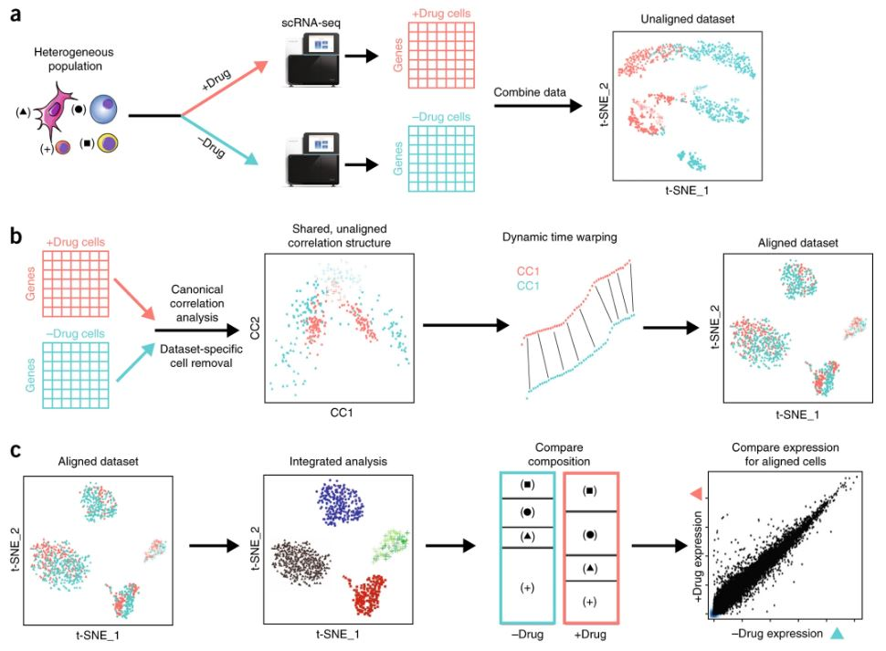

## Overview of single-cell analysis using Seurat
Seurat is a powerful R based scRNAseq analysis package designed for QC, analysis, and exploration of single-cell RNA-seq data. Seurat enables users to perform batch correction integration and identify and interpret sources of heterogeneity from single-cell transcriptomic measurements. 

Figure adapted from [Butler et al., 2018: Nature Biotechnology](https://www.nature.com/articles/nbt.4096)

In this course we will take a PBMC dataset derived from [Kang et al., 2017: Nature Biotechnology](https://www.nature.com/articles/nbt.4042) and perform basic sequential QC, integration and DE analysis using the [Seurat integration pipeline](https://satijalab.org/seurat/articles/integration_introduction.html). 

----

[Just the Docs]: https://just-the-docs.github.io/just-the-docs/
[GitHub Pages]: https://docs.github.com/en/pages
[README]: https://github.com/just-the-docs/just-the-docs-template/blob/main/README.md
[Jekyll]: https://jekyllrb.com
[GitHub Pages / Actions workflow]: https://github.blog/changelog/2022-07-27-github-pages-custom-github-actions-workflows-beta/
[use this template]: https://github.com/just-the-docs/just-the-docs-template/generate
