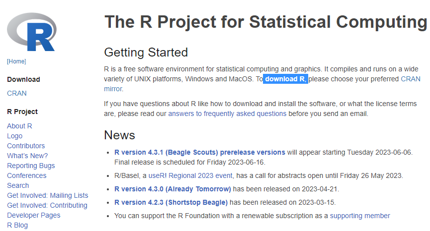
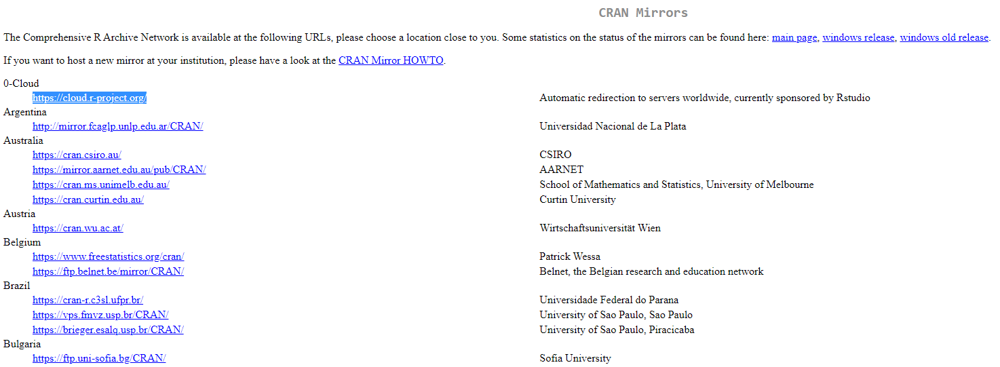
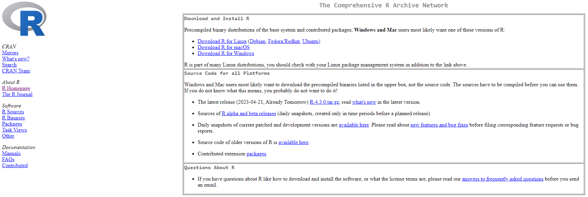
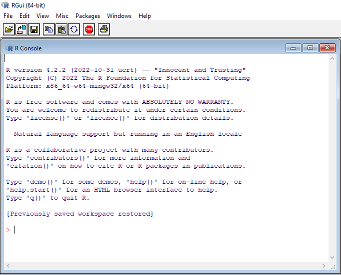
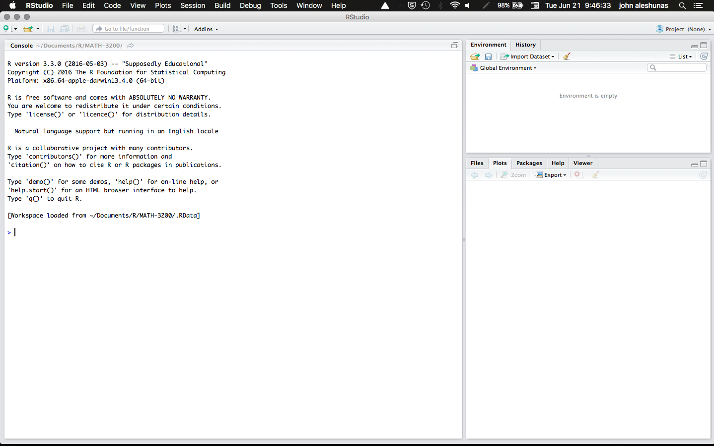

## Here we will go over a basic introduction to R

### What is R?
R is a free to download and use open-source computer language developed by Ross Ihaka and Robert Gentleman in 1993. It is an updated version of its predecessor the S programming language, which was commonly utilised in the early 1980s for statistical programming. R is designed to process and analyze complex statistical computations, store analysis and display results using complex visual graphics. R works in a sandbox known as the "environment"  which is a collection of objects such as variables, functions, tables etc. The underlying coding architecture of R is written in C, Fortran, and R itself. Complex workflows of functions are stored in the form of "packages" which can be installed in R and used to execute a series of tasks on a dataset. These packages are written in R however they may rely on C, C++, python and Fortran. R's computational philisophy is centered on object oriented programming (OOP).

### Lets install R
In order to install R navigate to the R download page. R is a free to download and use statistical software, unlike many of the softwares out there, it is totally free for the entire community! Anyone can use R.
In order to download R go here: [R Download Page](https://www.r-project.org/). Here a page like this will open up:

Now click on the link that says **download R** which will take you to the following page:

This page is the The Comprehensive R Archive Network (CRAN) mirror page which allows you to specify which country's mirror you will use to download R. R is stored in multiple redundant servers across the world.
Once you have clicked on the highlighted link you will now go to the following page:

 

From here click on the download link that matches with your operating system (OS) for example I am using Ubuntu/Windows so I will click on either **Download R for Linux (Debian, Fedora/Redhat, Ubuntu)** or **Download R for Windows** depending on the OS I am using. The next page will take you to a donwload page, you want to install R in its basic form so click on  **install R for the first time**. Once you have downloaded the installer, proceed to complete the installation process by accepting default settings. You have now installed R, however R in its basic form is not productive to use and opens as a basic console:

The console is called a GUI or [Gaphical User Interface](https://en.wikipedia.org/wiki/Graphical_user_interface), however a more interactive method of using R is via an [Integrated Development Environment (IDE)](https://en.wikipedia.org/wiki/Integrated_development_environment) which allows us to perform a variety of different actions including scripting, running scripts, visualizing results in a graphical interface, managing files and R packages. 

### Lets install RStudio

The IDE of our choice is the RStudio IDE which can be found here: [Download RStudio for desktop](https://posit.co/download/rstudio-desktop/). Just download and install the version of RStudio that matches your OS and open it, you should see a console pop up like this:

When you access RStudio on your computer, a window appears with multiple panes. The largest pane is called the console window. The console window is where you will execute R code, and see if your code is running. Importantly the console window initially opens up in the same position that it opens up in R. All the other panes are specific to RStudio. Some other panes include the script editor, graphics window,  file manager, and many more more. Here is where we will save and run code.

----

