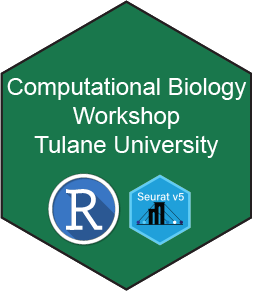

# Welcome to the Computational Biology 1 Workshop (CB1W)!

In this workshop, attendees will learn how to utilize the Seurat package in R to analyze single-cell RNA sequencing data.

## Learning Outline:
### Day 1
1. Introduction to single-cell RNA sequencing
2. Experimental design
3. Comparison of library preparation and sequencing platforms
4. Overview of single-cell analysis using Seurat
5. Installing R and basic syntax

----

[Just the Docs]: https://just-the-docs.github.io/just-the-docs/
[GitHub Pages]: https://docs.github.com/en/pages
[README]: https://github.com/just-the-docs/just-the-docs-template/blob/main/README.md
[Jekyll]: https://jekyllrb.com
[GitHub Pages / Actions workflow]: https://github.blog/changelog/2022-07-27-github-pages-custom-github-actions-workflows-beta/
[use this template]: https://github.com/just-the-docs/just-the-docs-template/generate
