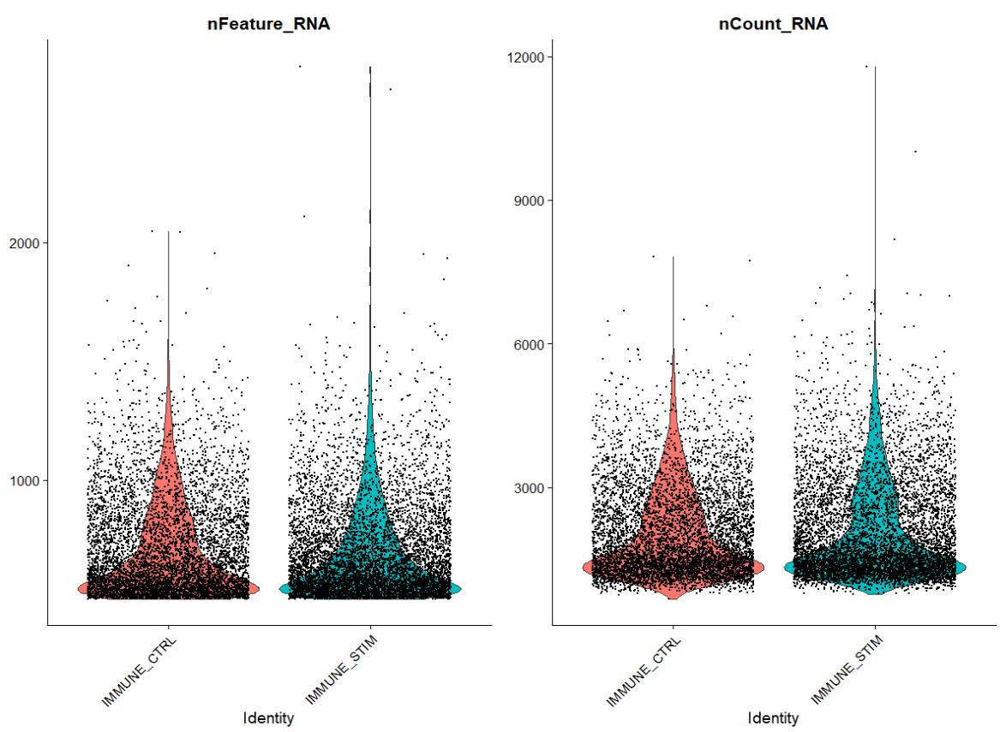
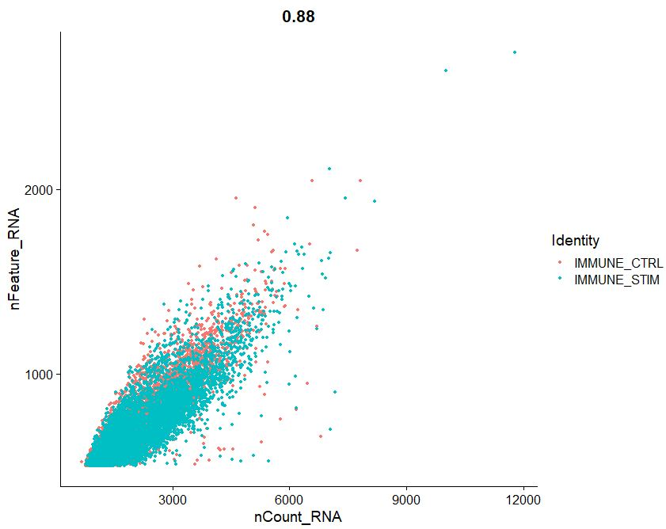
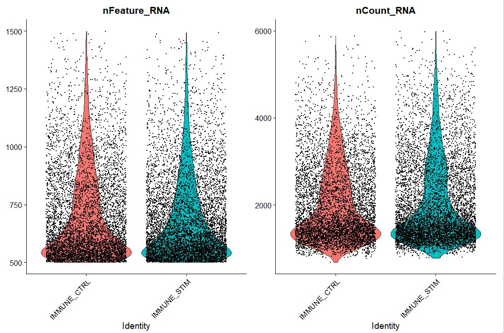
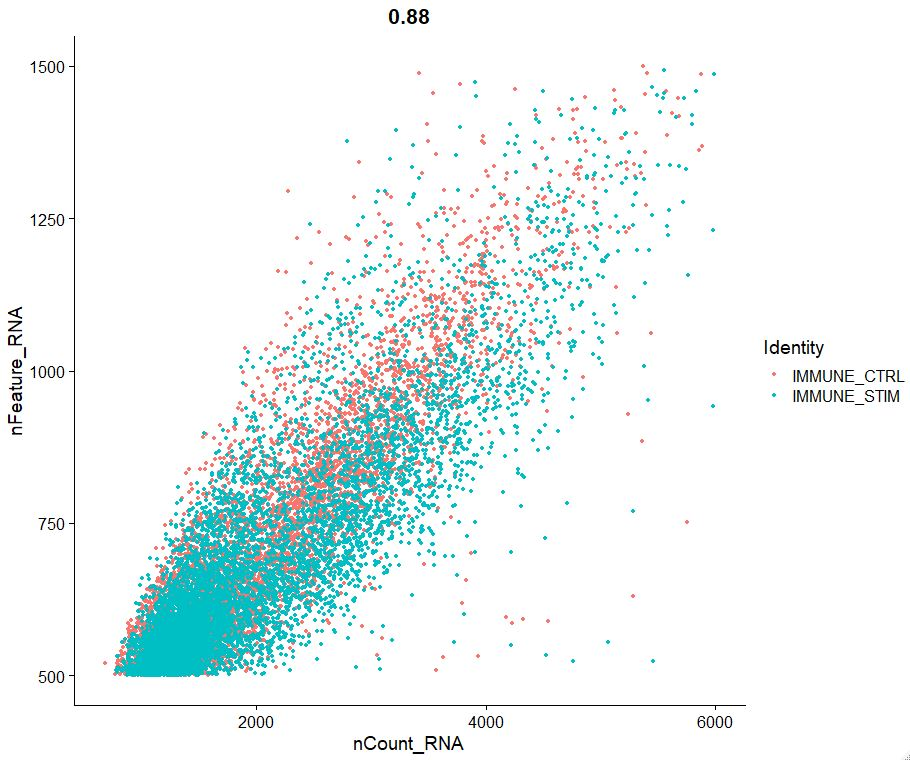

## Data loading/QC/filtering
Here we will load a dataset available for download as part of Seurat's `SeuratData` tutorial data collection
### STEP1 Installation
```r
# Welcome to CompBio1!!
# Course instructor: Fahd Qadir Dragonmasterx87 on Github, for questions create an issue in the course repository
# First we will install packages required to run Seurat

# Install the remotes, dplyr, patchwork and dectools packages
install.packages('remotes')
install.packages("dplyr")
install.packages("patchwork")
install.packages("devtools")
install.packages("qs")
devtools::install_github("gaospecial/ggVennDiagram")
install.packages("ggvenn")

if (!requireNamespace("BiocManager", quietly = TRUE))
  install.packages("BiocManager")
BiocManager::install(version = "3.15")
BiocManager::install("dittoSeq")

# Install version 4.3.0 of Seurat
remotes::install_github("cran/spatstat.core")
remotes::install_version(package = 'Seurat', version = package_version('4.3.0'))

# If you are having a recurrent issue with installation just use the following:
install.packages("Seurat")

# Install a tutorial data library, if you can't access don't worry you can just skip this code, install harmony load packages (STEP2) and then move to STEP3B
devtools::install_github("satijalab/seurat-data", ref = 'develop', force = TRUE)

# Install Harmony https://www.nature.com/articles/s41592-019-0619-0
# https://github.com/immunogenomics/harmony
install.packages("harmony")

# STEP2 Now load packages, are these all the packages you will need?
# I guess we will see!
suppressPackageStartupMessages({
  library(dplyr)
  library(Rcpp)
  library(harmony)
  library(Seurat)
  library(patchwork)
  library(SeuratData)
  library(qs)
  library(ggplot2)
  set.seed(1234)
})

# Check
packageVersion("Seurat")
```
```r
#OUTPUT
[1] '4.3.0'
```
```r
packageVersion("harmony")
```
```r
#OUTPUT
[1] '0.1.1'
```

### STEP3 can be bypassed and you can directly upload data from [here](https://tulane.box.com/s/7bs56dhan7ajhoj7suyjzo45t46e59rs) proceed to STEP3B
In this example, we are using a PBMC dataset generated by 10X Genomics. This is a popular training dataset and is used by Seurat designers as well.
Here we will arbitrarily (for the sake of this tutorial) split the data into 4 donors so that we can see how differential testing can be performed later.
```r
# STEP3 install dataset
InstallData("ifnb")

# load and process dataset
LoadData("ifnb")

# split the dataset into a list of two seurat objects (stim and CTRL)
ifnb.list <- SplitObject(ifnb, split.by = "stim")

# Split two objects into 2
ctrl <- ifnb.list[["CTRL"]]
stim <- ifnb.list[["STIM"]]

# Lets randomly split data into n = 3 donors, remember this is just for simulation purposes
# the actual data is just n = 1
k <- 4
ctrl$k.assign <- sample(x = 1:k, size = ncol(ctrl), replace = TRUE)
ctrl.split <- SplitObject(ctrl, split.by = 'k.assign')
length(ctrl.split)
ctrl.split
names(ctrl.split) <- c("ctrl.d1", "ctrl.d2", "ctrl.d3", "ctrl.d4")

k <- 4
stim$k.assign <- sample(x = 1:k, size = ncol(stim), replace = TRUE)
stim.split <- SplitObject(stim, split.by = 'k.assign')
length(stim.split)
stim.split
names(stim.split) <- c("stim.d1", "stim.d2", "stim.d3", "stim.d4")

# Save files for tutorial
{
  qsave(ifnb.list[["ctrl.d1"]], r"(C:\Users\mqadir\Box\Courses-Workshops\CompBioW1\Fahd_shared_with_participants\data\ctrl.d1.qs)")
  qsave(ifnb.list[["ctrl.d2"]], r"(C:\Users\mqadir\Box\Courses-Workshops\CompBioW1\Fahd_shared_with_participants\data\ctrl.d2.qs)")
  qsave(ifnb.list[["ctrl.d3"]], r"(C:\Users\mqadir\Box\Courses-Workshops\CompBioW1\Fahd_shared_with_participants\data\ctrl.d3.qs)")
  qsave(ifnb.list[["ctrl.d4"]], r"(C:\Users\mqadir\Box\Courses-Workshops\CompBioW1\Fahd_shared_with_participants\data\ctrl.d4.qs)")

  qsave(ifnb.list[["stim.d1"]], r"(C:\Users\mqadir\Box\Courses-Workshops\CompBioW1\Fahd_shared_with_participants\data\stim.d1.qs)")
  qsave(ifnb.list[["stim.d2"]], r"(C:\Users\mqadir\Box\Courses-Workshops\CompBioW1\Fahd_shared_with_participants\data\stim.d2.qs)")
  qsave(ifnb.list[["stim.d3"]], r"(C:\Users\mqadir\Box\Courses-Workshops\CompBioW1\Fahd_shared_with_participants\data\stim.d3.qs)")
  qsave(ifnb.list[["stim.d4"]], r"(C:\Users\mqadir\Box\Courses-Workshops\CompBioW1\Fahd_shared_with_participants\data\stim.d4.qs)")
}
```
### STEP3B Loading either qs or rds files based on what works for you 

```r

# STEP4 Load prepared Seurat files
# This code has been updated based on changes we made during the course (8/11/2023)
# How to load files if you are using qs
{
  ctrl.d1 <- qread(r"(C:\Users\mqadir\Box\Courses-Workshops\CompBioW1\Fahd_shared_with_participants\data\ctrl.d1.qs)")
  ctrl.d2 <- qread(r"(C:\Users\mqadir\Box\Courses-Workshops\CompBioW1\Fahd_shared_with_participants\data\ctrl.d2.qs)")
  ctrl.d3 <- qread(r"(C:\Users\mqadir\Box\Courses-Workshops\CompBioW1\Fahd_shared_with_participants\data\ctrl.d3.qs)")
  ctrl.d4 <- qread(r"(C:\Users\mqadir\Box\Courses-Workshops\CompBioW1\Fahd_shared_with_participants\data\ctrl.d4.qs)")
  
  stim.d1 <- qread(r"(C:\Users\mqadir\Box\Courses-Workshops\CompBioW1\Fahd_shared_with_participants\data\stim.d1.qs)")
  stim.d2 <- qread(r"(C:\Users\mqadir\Box\Courses-Workshops\CompBioW1\Fahd_shared_with_participants\data\stim.d2.qs)")
  stim.d3 <- qread(r"(C:\Users\mqadir\Box\Courses-Workshops\CompBioW1\Fahd_shared_with_participants\data\stim.d3.qs)")
  stim.d4 <- qread(r"(C:\Users\mqadir\Box\Courses-Workshops\CompBioW1\Fahd_shared_with_participants\data\stim.d4.qs)")
}

# How to load files if you are using RDS
{
  ctrl.d1 <- readRDS(r"(C:\Users\mqadir\Box\Courses-Workshops\CompBioW1\Fahd_shared_with_participants\data\ctrl.d1.rds)")
  ctrl.d2 <- readRDS(r"(C:\Users\mqadir\Box\Courses-Workshops\CompBioW1\Fahd_shared_with_participants\data\ctrl.d2.rds)")
  ctrl.d3 <- readRDS(r"(C:\Users\mqadir\Box\Courses-Workshops\CompBioW1\Fahd_shared_with_participants\data\ctrl.d3.rds)")
  ctrl.d4 <- readRDS(r"(C:\Users\mqadir\Box\Courses-Workshops\CompBioW1\Fahd_shared_with_participants\data\ctrl.d4.rds)")
  
  stim.d1 <- readRDS(r"(C:\Users\mqadir\Box\Courses-Workshops\CompBioW1\Fahd_shared_with_participants\data\stim.d1.rds)")
  stim.d2 <- readRDS(r"(C:\Users\mqadir\Box\Courses-Workshops\CompBioW1\Fahd_shared_with_participants\data\stim.d2.rds)")
  stim.d3 <- readRDS(r"(C:\Users\mqadir\Box\Courses-Workshops\CompBioW1\Fahd_shared_with_participants\data\stim.d3.rds)")
  stim.d4 <- readRDS(r"(C:\Users\mqadir\Box\Courses-Workshops\CompBioW1\Fahd_shared_with_participants\data\stim.d4.rds)")
}
```

### STEP5 Addition of donor metadata
Adding metadata to your Seurat object is fundamental. This is how you can interactively pull various pieces of information from the object, and use this
data to plot and analyze.
```r
# This code has been updated based on changes we made during the course (8/11/2023)
# Lets make 2x lists called ctrl.split and stim.split
ctrl.split <- list("ctrl.d1" = ctrl.d1, "ctrl.d2" = ctrl.d2, "ctrl.d3" = ctrl.d3, "ctrl.d4" = ctrl.d4)
stim.split <- list("stim.d1" = stim.d1, "stim.d2" = stim.d2, "stim.d3" = stim.d3, "stim.d4" = stim.d4)

ifnb.list[["ctrl.d1"]]$donor <- "d1"
ifnb.list[["ctrl.d2"]]$donor <- "d2"
ifnb.list[["ctrl.d3"]]$donor <- "d3"
ifnb.list[["ctrl.d4"]]$donor <- "d4"

ifnb.list[["stim.d1"]]$donor <- "d1"
ifnb.list[["stim.d2"]]$donor <- "d2"
ifnb.list[["stim.d3"]]$donor <- "d3"
ifnb.list[["stim.d4"]]$donor <- "d4"
```

OR

```r
# If you are just loading data from your saved file and dont have a saved ifnb.list object
ctrl.d1$donor <- "d1"
ctrl.d2$donor <- "d2"
ctrl.d3$donor <- "d3"
ctrl.d4$donor <- "d4"

stim.d1$donor <- "d1"
stim.d2$donor <- "d2"
stim.d3$donor <- "d3"
stim.d4$donor <- "d4"
```

### STEP6 Create a unified list, remember object name comes first in list notation
Here we are just creating one list of objects, click on ifnb.list in the Global Environment, what information do you see?
```r
ifnb.list <- list("ctrl.d1" = ctrl.d1, "ctrl.d2" = ctrl.d2, "ctrl.d3" = ctrl.d3, "ctrl.d4" = ctrl.d4,
                  "stim.d1" = stim.d1, "stim.d2" = stim.d2, "stim.d3" = stim.d3, "stim.d4" = stim.d4)
```

### STEP7 Merge objects
Now we are merging the Seurat objects to create one unified Seurat object for downstream analysis.
```r
pbmc <- merge(ifnb.list[["ctrl.d1"]], y = c(ifnb.list[["ctrl.d2"]], ifnb.list[["ctrl.d3"]], ifnb.list[["ctrl.d4"]],
                                            ifnb.list[["stim.d1"]], ifnb.list[["stim.d2"]], ifnb.list[["stim.d3"]], ifnb.list[["stim.d4"]]), 
              add.cell.ids = c("ctrl.d1", "ctrl.d2", "ctrl.d3", "ctrl.d4",
                               "stim.d1", "stim.d2", "stim.d3", "stim.d4"), project = "pbmc")
```

### STEP8 QC
Quality control (QC) is very important in any scientific experiment. Many factors such as batch effects, library composition bias, or even the handler performing the experiment, can adversely effect the outcome.
In order to remove poor quality cells we use thresholds such as number of genes and mitochondrial percentage to threshold cells and keep or remove them
```r
# The [[ operator can add columns to object metadata. This is a great place to stash QC stats
grep ("^CCL", rownames(pbmc[["RNA"]]),value = T)
```
```r
#OUTPUT
[1] "CCL20"  "CCL28"  "CCL27"  "CCL19"  "CCL22"  "CCL2"   "CCL7"   "CCL8"   "CCL13"  "CCL5"   "CCL23"  "CCL3"  
[13] "CCL4"   "CCL3L3" "CCL4L1" "CCL3L1" "CCL4L2" "CCL1"   "CCL18"
```
```r
pbmc[["percent.mt"]] <- PercentageFeatureSet(pbmc, pattern = "^mt-") # this dataset doesnt contain MT DNA, otherwise we subset on <10% MT
```

### Visualize QC metrics as a violin plot
```r
VlnPlot(pbmc, features = c("nFeature_RNA", "nCount_RNA"), ncol = 2)
#OUTPUT
```

```r
FeatureScatter(pbmc, feature1 = "nCount_RNA", feature2 = "nFeature_RNA")
#OUTPUT
```

```r
# Subset data
pbmc <- subset(pbmc, subset = nFeature_RNA > 200 & nFeature_RNA < 1500 & nCount_RNA < 6000)

# Lets visualize new QC metrics as a violin plot
VlnPlot(pbmc, features = c("nFeature_RNA", "nCount_RNA"), ncol = 2)
#OUTPUT
```

```r
FeatureScatter(pbmc, feature1 = "nCount_RNA", feature2 = "nFeature_RNA")
#OUTPUT
```

----

[Just the Docs]: https://just-the-docs.github.io/just-the-docs/
[GitHub Pages]: https://docs.github.com/en/pages
[README]: https://github.com/just-the-docs/just-the-docs-template/blob/main/README.md
[Jekyll]: https://jekyllrb.com
[GitHub Pages / Actions workflow]: https://github.blog/changelog/2022-07-27-github-pages-custom-github-actions-workflows-beta/
[use this template]: https://github.com/just-the-docs/just-the-docs-template/generate
