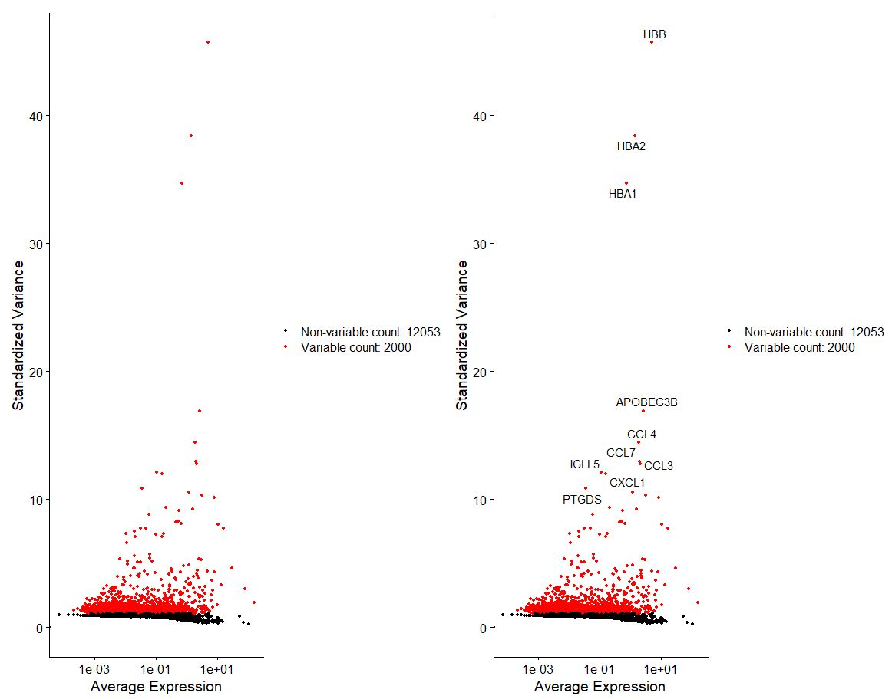

## Normalization using VST
### STEP9 Data processing

The first step in data processing is the process of normalization, in this case we are performing a log transformation of the data and scaling it to a factor of 10,000

```r
# Normalize and identify variable features for each dataset independently
pbmc <- NormalizeData(pbmc, normalization.method = "LogNormalize", scale.factor = 10000)
```
```r
#OUTPUT
Performing log-normalization
0%   10   20   30   40   50   60   70   80   90   100%
[----|----|----|----|----|----|----|----|----|----|
**************************************************|
```

Now we want to select for most variable features in our dataset, or in this instance the top 2000 most variable features.

```r
# select highly variable features
pbmc <- FindVariableFeatures(pbmc, selection.method = "vst", nfeatures = 2000)
```
```r
#OUTPUT
Calculating gene variances
0%   10   20   30   40   50   60   70   80   90   100%
[----|----|----|----|----|----|----|----|----|----|
**************************************************|
Calculating feature variances of standardized and clipped values
0%   10   20   30   40   50   60   70   80   90   100%
[----|----|----|----|----|----|----|----|----|----|
**************************************************|
```
```r
# Identify the 10 most highly variable genes
top10 <- head(VariableFeatures(pbmc), 10)
top10
```
```r
#OUTPUT
[1] "HBB"      "HBA2"     "HBA1"     "APOBEC3B" "CCL4"     "CCL7"     "CCL3"     "IGLL5"    "CXCL1"    "PTGDS"
```
```r
# plot variable features with and without labels
plot1 <- VariableFeaturePlot(pbmc, assay = "RNA")
plot2 <- LabelPoints(plot = plot1, points = top10, repel = TRUE, xnudge = 0, ynudge = 0)
plot1 + plot2
```
```r
#OUTPUT
Warning messages:
1: Transformation introduced infinite values in continuous x-axis 
2: Transformation introduced infinite values in continuous x-axis
```


Next, we are going to perform an action that scales and centers features in the dataset.

```r
# Scale data
all.genes <- rownames(pbmc)
pbmc <- ScaleData(pbmc, features = all.genes, verbose = TRUE)
```
```r
#OUTPUT
Centering and scaling data matrix
  |===========================================================================================================| 100%
```

----

[Just the Docs]: https://just-the-docs.github.io/just-the-docs/
[GitHub Pages]: https://docs.github.com/en/pages
[README]: https://github.com/just-the-docs/just-the-docs-template/blob/main/README.md
[Jekyll]: https://jekyllrb.com
[GitHub Pages / Actions workflow]: https://github.blog/changelog/2022-07-27-github-pages-custom-github-actions-workflows-beta/
[use this template]: https://github.com/just-the-docs/just-the-docs-template/generate
