## Multidimensional reduction and cell clustering
### STEP10 Linear dimensionality reduction
```r
pbmc <- RunPCA(pbmc, pc.genes = pbmc@assays$RNA@var.features, npcs = 20, verbose = TRUE)
PC_ 1 
Positive:  TYROBP, C15orf48, FCER1G, CST3, SOD2, ANXA5, TYMP, FTL, CD63, TIMP1 
	   LGALS1, CTSB, KYNU, FCN1, LGALS3, S100A4, APOBEC3A, PSAP, NPC2, ANXA2 
	   IGSF6, S100A11, LYZ, CD68, SPI1, CTSL, NINJ1, CCL2, SDCBP, HLA-DRA 
Negative:  CCR7, LTB, GIMAP7, CD3D, CD7, SELL, CD2, TRAT1, IL7R, CLEC2D 
	   PTPRCAP, ITM2A, IL32, RHOH, RGCC, LEF1, CD3G, ALOX5AP, CD247, CREM 
	   PASK, TSC22D3, SNHG8, MYC, GPR171, BIRC3, NOP58, CD27, CD8B, SRM 
PC_ 2 
Positive:  IL8, CLEC5A, CD14, VCAN, S100A8, IER3, MARCKSL1, IL1B, PID1, CD9 
	   GPX1, PLAUR, INSIG1, PHLDA1, PPIF, THBS1, S100A9, GAPDH, OSM, LIMS1 
	   SLC7A11, GAPT, ACTB, CTB-61M7.2, ENG, CEBPB, OLR1, CXCL3, FTH1, MGST1 
Negative:  ISG20, ISG15, IFIT3, IFIT1, LY6E, MX1, TNFSF10, IFIT2, IFI6, RSAD2 
	   CXCL10, OAS1, CXCL11, MT2A, IFITM3, IRF7, OASL, IFITM2, TNFSF13B, SAMD9L 
	   IDO1, IL1RN, GBP1, CMPK2, CCL8, DDX58, APOBEC3A, PLSCR1, GBP4, FAM26F 
PC_ 3 
Positive:  HLA-DQA1, CD83, HLA-DQB1, CD74, HLA-DPA1, HLA-DRA, HLA-DPB1, HLA-DRB1, SYNGR2, IRF8 
	   CD79A, MS4A1, HERPUD1, MIR155HG, HLA-DMA, REL, TVP23A, HSP90AB1, ID3, TSPAN13 
	   FABP5, CCL22, BLNK, EBI3, TCF4, PMAIP1, PRMT1, NME1, SPIB, HVCN1 
Negative:  ANXA1, GIMAP7, CD3D, CD7, CD2, RARRES3, MT2A, IL32, GNLY, CCL2 
	   PRF1, CD247, S100A9, TRAT1, RGCC, CCL7, NKG7, CCL5, CTSL, HPSE 
	   S100A8, CCL8, CD3G, ITM2A, KLRD1, GZMH, GZMA, CTSW, OASL, GPR171 
PC_ 4 
Positive:  CCR7, LTB, SELL, LEF1, IL7R, ADTRP, TRAT1, PASK, MYC, SOCS3 
	   CD3D, TSC22D3, HSP90AB1, TSHZ2, GIMAP7, SNHG8, TARBP1, CMTM8, PIM2, HSPD1 
	   CD3G, GBP1, TXNIP, RHOH, BIRC3, C12orf57, PNRC1, CA6, CD27, CMSS1 
Negative:  NKG7, GZMB, GNLY, CST7, CCL5, PRF1, CLIC3, KLRD1, GZMH, GZMA 
	   APOBEC3G, CTSW, FGFBP2, KLRC1, FASLG, C1orf21, HOPX, CXCR3, SH2D1B, LINC00996 
	   TNFRSF18, SPON2, RARRES3, GCHFR, SH2D2A, IGFBP7, ID2, C12orf75, XCL2, S1PR5 
PC_ 5 
Positive:  CCL2, CCL7, CCL8, PLA2G7, LMNA, TXN, S100A9, SDS, CSTB, CAPG 
	   EMP1, CCR1, IDO1, CCR5, MGST1, SLC7A11, FABP5, LILRB4, GCLM, HSPA1A 
	   CTSB, VIM, PDE4DIP, CCNA1, HPSE, LYZ, RSAD2, SGTB, FPR3, CREG1 
Negative:  VMO1, FCGR3A, MS4A4A, MS4A7, CXCL16, PPM1N, HN1, LST1, SMPDL3A, CDKN1C 
	   CASP5, ATP1B3, CH25H, AIF1, PLAC8, SERPINA1, LRRC25, GBP5, CD86, HCAR3 
	   RGS19, RP11-290F20.3, COTL1, VNN2, C3AR1, LILRA5, STXBP2, PILRA, ADA, FCGR3B 

# Visualize PCA
VizDimLoadings(pbmc, dims = 1:2, reduction = "pca")
```
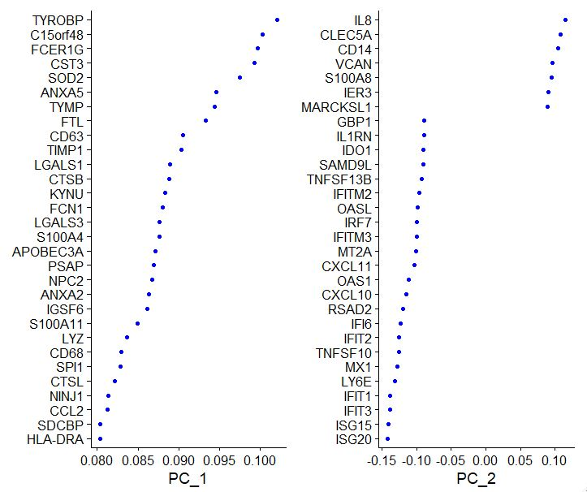
```r
DimPlot(pbmc, reduction = "pca")
```
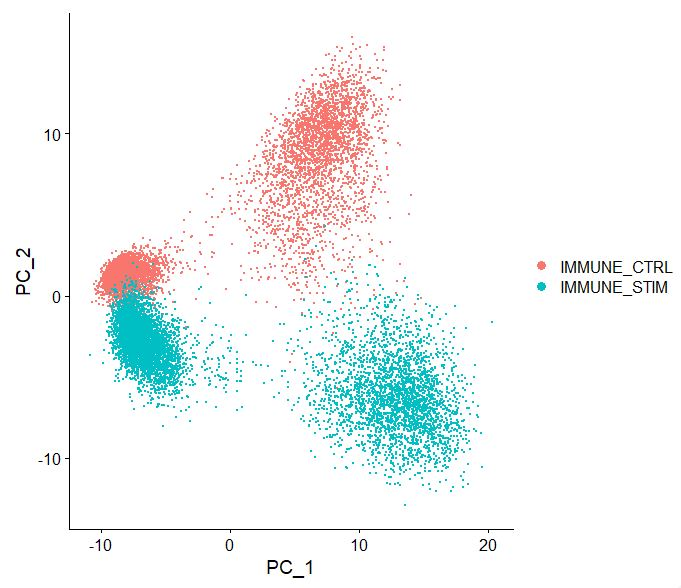
```r
# Determine dimensionality of dataset
# NOTE: This process can take a long time for big datasets, comment out for expediency. More
# approximate techniques such as those implemented in ElbowPlot() can be used to reduce
# computation time
pbmc <- JackStraw(pbmc, num.replicate = 100)
pbmc <- ScoreJackStraw(pbmc, dims = 1:20)
|++++++++++++++++++++++++++++++++++++++++++++++++++| 100% elapsed=05m 07s
|++++++++++++++++++++++++++++++++++++++++++++++++++| 100% elapsed=00s 
JackStrawPlot(pbmc, dims = 1:20)
```
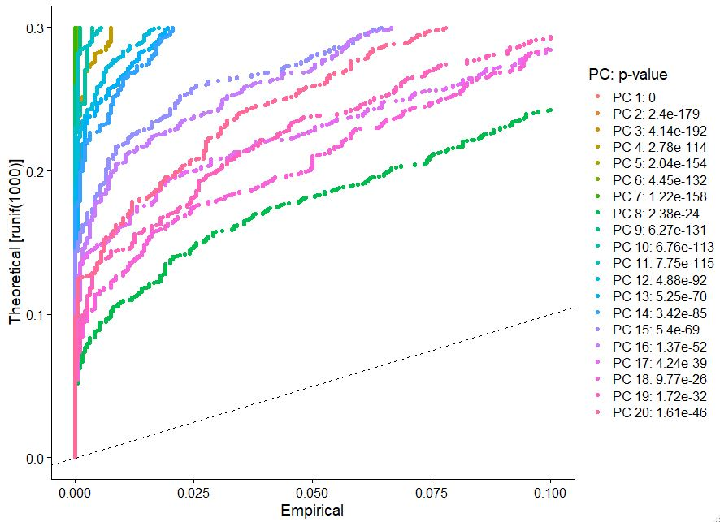
```r
# Visualize elbow plot of PC
ElbowPlot(pbmc)
```
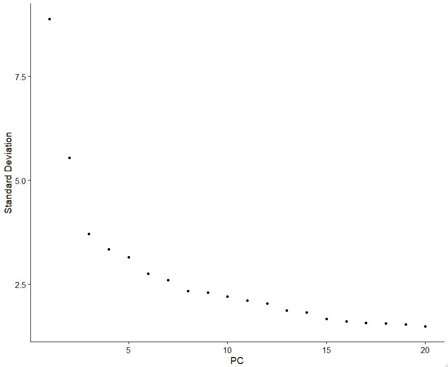

### STEP11 Batch correction using Harmony
```r
#Run Harmony batch correction with library and tissue source covariates
pbmc <- RunHarmony(pbmc,
                   assay.use = "RNA",
                   reduction = "pca",
                   dims.use = 1:20,
                   group.by.vars = c("donor", "stim"),
                   kmeans_init_nstart=20, kmeans_init_iter_max=100,
                   plot_convergence = TRUE)
Harmony 1/10
0%   10   20   30   40   50   60   70   80   90   100%
[----|----|----|----|----|----|----|----|----|----|
**************************************************|
Harmony 2/10
0%   10   20   30   40   50   60   70   80   90   100%
[----|----|----|----|----|----|----|----|----|----|
**************************************************|
Harmony 3/10
0%   10   20   30   40   50   60   70   80   90   100%
[----|----|----|----|----|----|----|----|----|----|
**************************************************|
Harmony 4/10
0%   10   20   30   40   50   60   70   80   90   100%
[----|----|----|----|----|----|----|----|----|----|
**************************************************|
Harmony 5/10
0%   10   20   30   40   50   60   70   80   90   100%
[----|----|----|----|----|----|----|----|----|----|
**************************************************|
Harmony 6/10
0%   10   20   30   40   50   60   70   80   90   100%
[----|----|----|----|----|----|----|----|----|----|
**************************************************|
Harmony 7/10
0%   10   20   30   40   50   60   70   80   90   100%
[----|----|----|----|----|----|----|----|----|----|
**************************************************|
Harmony 8/10
0%   10   20   30   40   50   60   70   80   90   100%
[----|----|----|----|----|----|----|----|----|----|
**************************************************|
Harmony 9/10
0%   10   20   30   40   50   60   70   80   90   100%
[----|----|----|----|----|----|----|----|----|----|
**************************************************|
Harmony converged after 9 iterations
Warning: Invalid name supplied, making object name syntactically valid. New object name is Seurat..ProjectDim.RNA.harmony; see ?make.names for more details on syntax validity
```
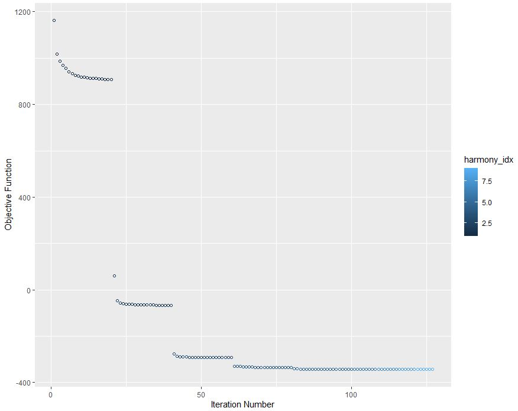

### STEP12 Non linear multidimensional projection using UMAP
```r
# Run UMAP, on PCA NON-batch corrected data
pbmc <- RunUMAP(pbmc, reduction = "pca", dims = 1:20, return.model = TRUE)
Warning: The default method for RunUMAP has changed from calling Python UMAP via reticulate to the R-native UWOT using the cosine metric
To use Python UMAP via reticulate, set umap.method to 'umap-learn' and metric to 'correlation'
This message will be shown once per session
UMAP will return its model
12:48:28 UMAP embedding parameters a = 0.9922 b = 1.112
12:48:28 Read 13923 rows and found 20 numeric columns
12:48:28 Using Annoy for neighbor search, n_neighbors = 30
12:48:28 Building Annoy index with metric = cosine, n_trees = 50
0%   10   20   30   40   50   60   70   80   90   100%
[----|----|----|----|----|----|----|----|----|----|
**************************************************|
12:48:29 Writing NN index file to temp file C:\Users\mqadir\AppData\Local\Temp\RtmpqizHXk\file4f6c49d77599
12:48:29 Searching Annoy index using 1 thread, search_k = 3000
12:48:32 Annoy recall = 100%
12:48:33 Commencing smooth kNN distance calibration using 1 thread with target n_neighbors = 30
12:48:34 Initializing from normalized Laplacian + noise (using irlba)
12:48:34 Commencing optimization for 200 epochs, with 598286 positive edges
Using method 'umap'
0%   10   20   30   40   50   60   70   80   90   100%
[----|----|----|----|----|----|----|----|----|----|
**************************************************|
12:48:46 Optimization finished
DimPlot(pbmc, reduction = 'umap', label = FALSE, pt.size = 2, raster=TRUE)
```
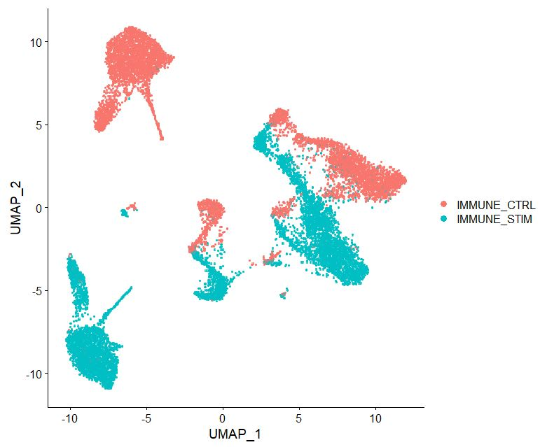
```r
# Now run Harmony
pbmc <- RunUMAP(pbmc, reduction = "harmony", dims = 1:20, return.model = TRUE)
UMAP will return its model
12:52:56 UMAP embedding parameters a = 0.9922 b = 1.112
12:52:56 Read 13923 rows and found 20 numeric columns
12:52:56 Using Annoy for neighbor search, n_neighbors = 30
12:52:56 Building Annoy index with metric = cosine, n_trees = 50
0%   10   20   30   40   50   60   70   80   90   100%
[----|----|----|----|----|----|----|----|----|----|
**************************************************|
12:52:57 Writing NN index file to temp file C:\Users\mqadir\AppData\Local\Temp\RtmpqizHXk\file4f6c2a32094
12:52:57 Searching Annoy index using 1 thread, search_k = 3000
12:53:00 Annoy recall = 100%
12:53:01 Commencing smooth kNN distance calibration using 1 thread with target n_neighbors = 30
12:53:03 Initializing from normalized Laplacian + noise (using irlba)
12:53:03 Commencing optimization for 200 epochs, with 603016 positive edges
Using method 'umap'
0%   10   20   30   40   50   60   70   80   90   100%
[----|----|----|----|----|----|----|----|----|----|
**************************************************|
12:53:14 Optimization finished
DimPlot(pbmc, reduction = 'umap', label = FALSE, pt.size = 2, raster=TRUE)
```
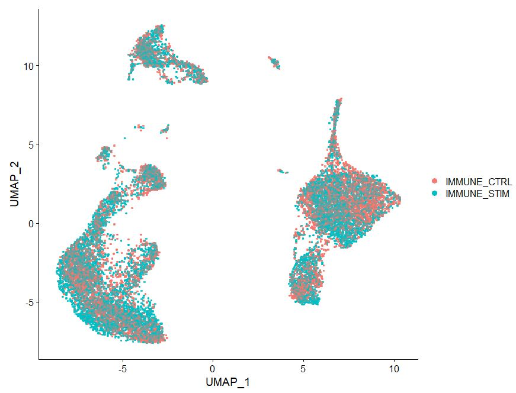
### STEP13 Clustering
```r
# Algorithm 3 is the smart local moving (SLM) algorithm https://link.springer.com/article/10.1140/epjb/e2013-40829-0
pbmc <- pbmc %>% 
  FindNeighbors(reduction = 'harmony', dims = 1:20) %>% 
  FindClusters(algorithm=3,resolution = c(0.5), method = 'igraph') #25 res
Computing nearest neighbor graph
Computing SNN
Modularity Optimizer version 1.3.0 by Ludo Waltman and Nees Jan van Eck

Number of nodes: 13923
Number of edges: 490868

Running smart local moving algorithm...
0%   10   20   30   40   50   60   70   80   90   100%
[----|----|----|----|----|----|----|----|----|----|
**************************************************|
Maximum modularity in 10 random starts: 0.8967
Number of communities: 14
Elapsed time: 8 seconds

Idents(pbmc) <- "seurat_annotations"
DimPlot(pbmc, reduction = "umap", label = TRUE)
```
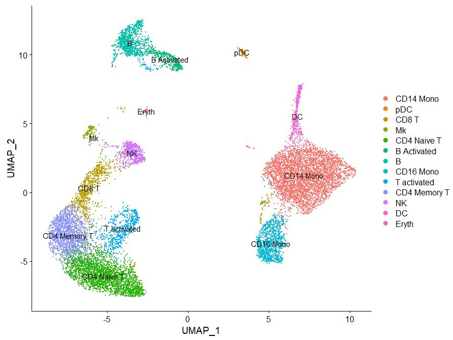
```r
# Observe gene expression
FeaturePlot(pbmc, features = c("CD3D", "SELL", "CREM", "CD8A", "GNLY", "CD79A", "FCGR3A",
                               "CCL2", "PPBP"), min.cutoff = "q9")
```
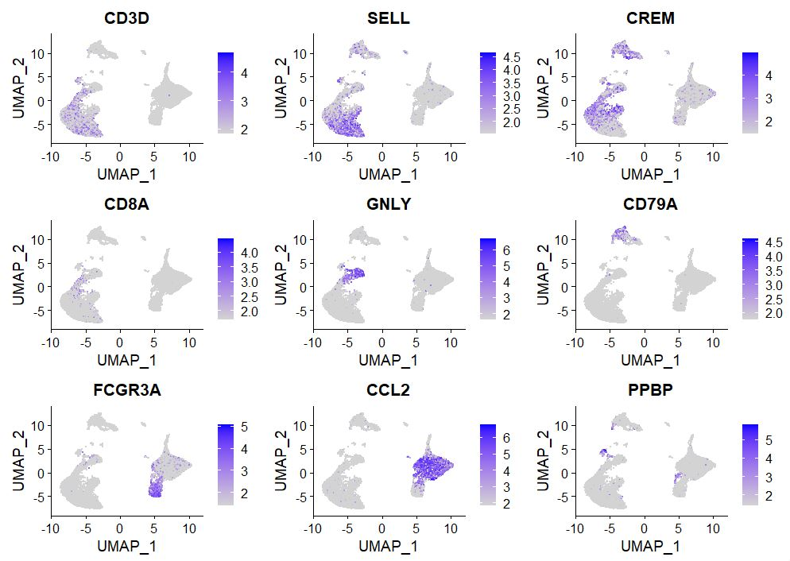
```r
# Rename clusters
Idents(pbmc) <- "RNA_snn_res.0.5"
table(pbmc@meta.data[["RNA_snn_res.0.5"]])
   0    1    2    3    4    5    6    7    8    9   10   11   12   13 
4323 2478 1716 1064  970  786  658  645  420  390  220  128   70   55 
DimPlot(pbmc, reduction = "umap", label = TRUE)
```
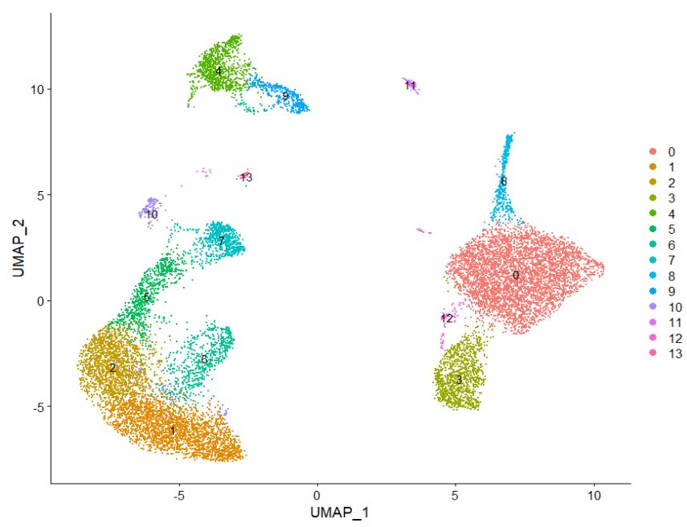
```r
new.cluster.ids <- c("CD14 Mono", "CD4 Naive T", "CD4 Memory T", "CD16 Mono", 
                     "B", "CD8 T", "T activated", "NK", "DC", "B Activated",
                     "Mk", "pDC", "Mono/Mk Doublets", "Eryth")
names(new.cluster.ids) <- levels(pbmc)
pbmc <- RenameIdents(pbmc, new.cluster.ids)
DimPlot(pbmc, reduction = "umap", label = TRUE, pt.size = 0.5) + NoLegend()
```
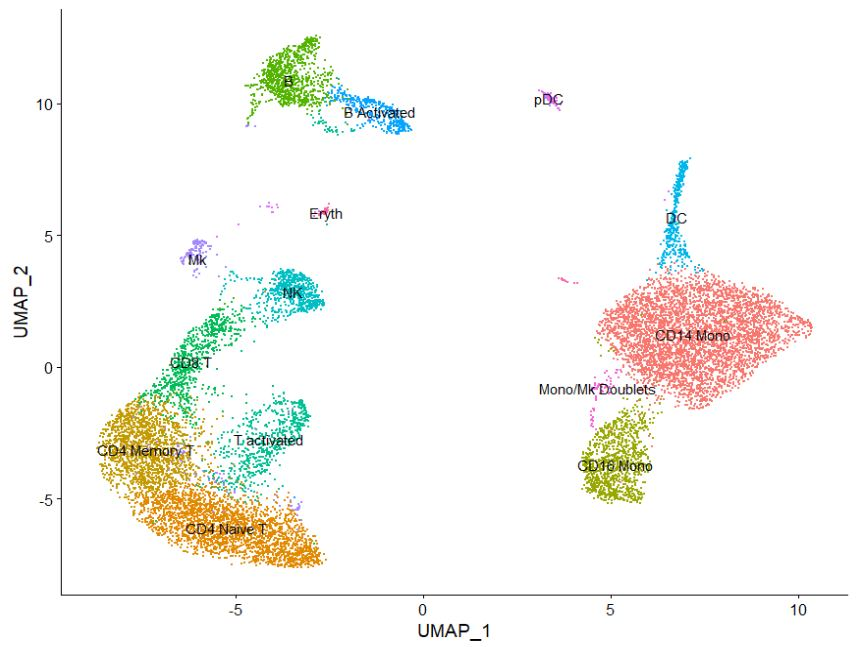

----

[Just the Docs]: https://just-the-docs.github.io/just-the-docs/
[GitHub Pages]: https://docs.github.com/en/pages
[README]: https://github.com/just-the-docs/just-the-docs-template/blob/main/README.md
[Jekyll]: https://jekyllrb.com
[GitHub Pages / Actions workflow]: https://github.blog/changelog/2022-07-27-github-pages-custom-github-actions-workflows-beta/
[use this template]: https://github.com/just-the-docs/just-the-docs-template/generate
