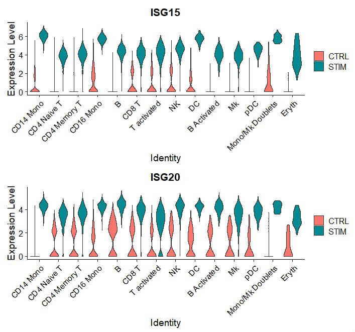

## Differential testing framework
### STEP13 Differential gene testing
### STEP13A: Single cell gene testing
```r
# In order to fine DE genes its important to annotate cells,
# this is where metadata comes to be important
# Our first method employs single cell differential gene expression using LR
pbmc$celltype.stim <- paste(pbmc$celltype, pbmc$stim, sep = "_")
Idents(pbmc) <- "celltype.stim"
b.interferon.response <- FindMarkers(pbmc, ident.1 = "B_STIM", ident.2 = "B_CTRL",
                                     slot = 'data',
                                     test.use = "LR",
                                     min.pct = 0.1,
                                     latent.vars = c("donor"),
                                     logfc.threshold = 0.5849, #~1.5FC
                                     only.pos = TRUE,
                                     verbose = FALSE)
Warning message:
glm.fit: fitted probabilities numerically 0 or 1 occurred 

head(b.interferon.response, n = 15)
```
```r
#OUTPUT
                p_val avg_log2FC pct.1 pct.2     p_val_adj
ISG15   1.886870e-251  4.5777825 0.998 0.244 2.651618e-247
ISG20   6.775871e-233  2.9286888 1.000 0.674 9.522132e-229
IFIT3   2.249518e-226  4.5012181 0.963 0.052 3.161247e-222
IFI6    7.675338e-222  4.2569268 0.965 0.077 1.078615e-217
IFIT1   1.235784e-197  4.1209722 0.908 0.032 1.736647e-193
MX1     1.447618e-160  3.2484413 0.908 0.116 2.034337e-156
TNFSF10 1.295544e-148  3.7724262 0.781 0.022 1.820627e-144
LY6E    1.309127e-148  3.1014142 0.894 0.151 1.839716e-144
IFIT2   4.554090e-142  3.6335959 0.786 0.037 6.399863e-138
B2M     2.530957e-119  0.6158652 1.000 1.000 3.556754e-115
CXCL10  4.799024e-113  5.3217240 0.644 0.010 6.744069e-109
PLSCR1  2.659608e-112  2.8015323 0.788 0.119 3.737548e-108
IRF7    3.667981e-108  2.5623663 0.837 0.193 5.154613e-104
HERC5    6.244788e-98  2.8136999 0.611 0.022  8.775800e-94
UBE2L6   7.032047e-91  2.1202128 0.857 0.301  9.882136e-87
```
```r
b.interferon.response <- dplyr::filter(b.interferon.response, p_val_adj < 5e-2)
plots <- VlnPlot(pbmc, features = c("ISG15", "ISG20"), split.by = "stim", group.by = "celltype",
                 pt.size = 0, combine = FALSE)
The default behaviour of split.by has changed.
Separate violin plots are now plotted side-by-side.
To restore the old behaviour of a single split violin,
set split.plot = TRUE.
      
This message will be shown once per session.
wrap_plots(plots = plots, ncol = 1)
#OUTPUT
```


### STEP13B: Pseudobulk testing
```r
DefaultAssay(pbmc) <- "RNA"
pbmc$celltype.stim.donor <- paste(pbmc$celltype, pbmc$stim, pbmc$donor, sep = "_")
Idents(pbmc) <- "celltype.stim.donor"
table(pbmc[["celltype.stim.donor"]])
celltype.stim.donor
```
```r
#OUTPUT
     B Activated_CTRL_d1      B Activated_CTRL_d2      B Activated_CTRL_d3      B Activated_CTRL_d4 
                      41                       46                       50                       46 
     B Activated_STIM_d1      B Activated_STIM_d2      B Activated_STIM_d3      B Activated_STIM_d4 
                      50                       66                       44                       47 
               B_CTRL_d1                B_CTRL_d2                B_CTRL_d3                B_CTRL_d4 
                     110                      109                       93                       93 
               B_STIM_d1                B_STIM_d2                B_STIM_d3                B_STIM_d4 
                     136                      141                      145                      143 
       CD14 Mono_CTRL_d1        CD14 Mono_CTRL_d2        CD14 Mono_CTRL_d3        CD14 Mono_CTRL_d4 
                     534                      582                      520                      573 
       CD14 Mono_STIM_d1        CD14 Mono_STIM_d2        CD14 Mono_STIM_d3        CD14 Mono_STIM_d4 
                     551                      535                      504                      524 
       CD16 Mono_CTRL_d1        CD16 Mono_CTRL_d2        CD16 Mono_CTRL_d3        CD16 Mono_CTRL_d4 
                     125                      124                      126                      143 
       CD16 Mono_STIM_d1        CD16 Mono_STIM_d2        CD16 Mono_STIM_d3        CD16 Mono_STIM_d4 
                     142                      141                      127                      136 
    CD4 Memory T_CTRL_d1     CD4 Memory T_CTRL_d2     CD4 Memory T_CTRL_d3     CD4 Memory T_CTRL_d4 
                     219                      200                      208                      186 
    CD4 Memory T_STIM_d1     CD4 Memory T_STIM_d2     CD4 Memory T_STIM_d3     CD4 Memory T_STIM_d4 
                     229                      197                      238                      239 
     CD4 Naive T_CTRL_d1      CD4 Naive T_CTRL_d2      CD4 Naive T_CTRL_d3      CD4 Naive T_CTRL_d4 
                     264                      230                      253                      256 
     CD4 Naive T_STIM_d1      CD4 Naive T_STIM_d2      CD4 Naive T_STIM_d3      CD4 Naive T_STIM_d4 
                     379                      367                      346                      383 
           CD8 T_CTRL_d1            CD8 T_CTRL_d2            CD8 T_CTRL_d3            CD8 T_CTRL_d4 
                      71                       72                       82                       95 
           CD8 T_STIM_d1            CD8 T_STIM_d2            CD8 T_STIM_d3            CD8 T_STIM_d4 
                     129                      119                      101                      117 
              DC_CTRL_d1               DC_CTRL_d2               DC_CTRL_d3               DC_CTRL_d4 
                      65                       61                       52                       48 
              DC_STIM_d1               DC_STIM_d2               DC_STIM_d3               DC_STIM_d4 
                      48                       39                       50                       57 
           Eryth_CTRL_d1            Eryth_CTRL_d2            Eryth_CTRL_d3            Eryth_CTRL_d4 
                       5                        5                        6                        6 
           Eryth_STIM_d1            Eryth_STIM_d2            Eryth_STIM_d3            Eryth_STIM_d4 
                       7                        9                       10                        7 
              Mk_CTRL_d1               Mk_CTRL_d2               Mk_CTRL_d3               Mk_CTRL_d4 
                      21                       30                       26                       21 
              Mk_STIM_d1               Mk_STIM_d2               Mk_STIM_d3               Mk_STIM_d4 
                      29                       28                       37                       28 
Mono/Mk Doublets_CTRL_d1 Mono/Mk Doublets_CTRL_d2 Mono/Mk Doublets_CTRL_d3 Mono/Mk Doublets_CTRL_d4 
                      17                        5                        9                       11 
Mono/Mk Doublets_STIM_d1 Mono/Mk Doublets_STIM_d2 Mono/Mk Doublets_STIM_d3 Mono/Mk Doublets_STIM_d4 
                       4                        7                       11                        6 
              NK_CTRL_d1               NK_CTRL_d2               NK_CTRL_d3               NK_CTRL_d4 
                      82                       63                       77                       90 
              NK_STIM_d1               NK_STIM_d2               NK_STIM_d3               NK_STIM_d4 
                      75                       85                       86                       87 
             pDC_CTRL_d1              pDC_CTRL_d2              pDC_CTRL_d3              pDC_CTRL_d4 
                      10                       15                        9                       17 
             pDC_STIM_d1              pDC_STIM_d2              pDC_STIM_d3              pDC_STIM_d4 
                      13                       23                       16                       25 
     T activated_CTRL_d1      T activated_CTRL_d2      T activated_CTRL_d3      T activated_CTRL_d4 
                      83                       79                       84                       69 
     T activated_STIM_d1      T activated_STIM_d2      T activated_STIM_d3      T activated_STIM_d4 
                      92                       91                       83                       77
```
```r
combined_pbmc <- AggregateExpression(pbmc, 
                                     assays = c("RNA"), 
                                     features = NULL, return.seurat = TRUE,  
                                     group.by = "celltype.stim.donor",
                                     slot = "counts", verbose = FALSE)

combined_pbmc$celltype.stim.donor <- Cells(combined_pbmc)

# Metadata organization and addition to aggregated object
{
  Idents(combined_pbmc) <- 'celltype.stim.donor'
  combined_pbmc$celltype <- combined_pbmc@meta.data[["orig.ident"]]
  metadat <- combined_pbmc@meta.data
  metadat$celltype <- metadat[c('celltype')] <- str_split_i(metadat$celltype.stim.donor, "_", -3)
  metadat$stim <- metadat[c('stim')] <- str_split_i(metadat$celltype.stim.donor, '_', -2)
  metadat$donor <- metadat[c('donor')] <- str_split_i(metadat$celltype.stim.donor, '_', -1)
  combined_pbmc@meta.data = metadat
}

table(combined_pbmc@meta.data[["celltype"]])
```
```r
#OUTPUT
               B      B Activated        CD14 Mono        CD16 Mono     CD4 Memory T      CD4 Naive T 
               8                8                8                8                8                8 
           CD8 T               DC            Eryth               Mk Mono/Mk Doublets               NK 
               8                8                8                8                8                8 
             pDC      T activated 
               8                8
```
```r
table(combined_pbmc@meta.data[["donor"]])
```
```r
#OUTPUT
d1 d2 d3 d4 
28 28 28 28
```
```r
table(combined_pbmc@meta.data[["celltype.stim.donor"]])
```
```r
#OUTPUT
     B Activated_CTRL_d1      B Activated_CTRL_d2      B Activated_CTRL_d3      B Activated_CTRL_d4 
                       1                        1                        1                        1 
     B Activated_STIM_d1      B Activated_STIM_d2      B Activated_STIM_d3      B Activated_STIM_d4 
                       1                        1                        1                        1 
               B_CTRL_d1                B_CTRL_d2                B_CTRL_d3                B_CTRL_d4 
                       1                        1                        1                        1 
               B_STIM_d1                B_STIM_d2                B_STIM_d3                B_STIM_d4 
                       1                        1                        1                        1 
       CD14 Mono_CTRL_d1        CD14 Mono_CTRL_d2        CD14 Mono_CTRL_d3        CD14 Mono_CTRL_d4 
                       1                        1                        1                        1 
       CD14 Mono_STIM_d1        CD14 Mono_STIM_d2        CD14 Mono_STIM_d3        CD14 Mono_STIM_d4 
                       1                        1                        1                        1 
       CD16 Mono_CTRL_d1        CD16 Mono_CTRL_d2        CD16 Mono_CTRL_d3        CD16 Mono_CTRL_d4 
                       1                        1                        1                        1 
       CD16 Mono_STIM_d1        CD16 Mono_STIM_d2        CD16 Mono_STIM_d3        CD16 Mono_STIM_d4 
                       1                        1                        1                        1 
    CD4 Memory T_CTRL_d1     CD4 Memory T_CTRL_d2     CD4 Memory T_CTRL_d3     CD4 Memory T_CTRL_d4 
                       1                        1                        1                        1 
    CD4 Memory T_STIM_d1     CD4 Memory T_STIM_d2     CD4 Memory T_STIM_d3     CD4 Memory T_STIM_d4 
                       1                        1                        1                        1 
     CD4 Naive T_CTRL_d1      CD4 Naive T_CTRL_d2      CD4 Naive T_CTRL_d3      CD4 Naive T_CTRL_d4 
                       1                        1                        1                        1 
     CD4 Naive T_STIM_d1      CD4 Naive T_STIM_d2      CD4 Naive T_STIM_d3      CD4 Naive T_STIM_d4 
                       1                        1                        1                        1 
           CD8 T_CTRL_d1            CD8 T_CTRL_d2            CD8 T_CTRL_d3            CD8 T_CTRL_d4 
                       1                        1                        1                        1 
           CD8 T_STIM_d1            CD8 T_STIM_d2            CD8 T_STIM_d3            CD8 T_STIM_d4 
                       1                        1                        1                        1 
              DC_CTRL_d1               DC_CTRL_d2               DC_CTRL_d3               DC_CTRL_d4 
                       1                        1                        1                        1 
              DC_STIM_d1               DC_STIM_d2               DC_STIM_d3               DC_STIM_d4 
                       1                        1                        1                        1 
           Eryth_CTRL_d1            Eryth_CTRL_d2            Eryth_CTRL_d3            Eryth_CTRL_d4 
                       1                        1                        1                        1 
           Eryth_STIM_d1            Eryth_STIM_d2            Eryth_STIM_d3            Eryth_STIM_d4 
                       1                        1                        1                        1 
              Mk_CTRL_d1               Mk_CTRL_d2               Mk_CTRL_d3               Mk_CTRL_d4 
                       1                        1                        1                        1 
              Mk_STIM_d1               Mk_STIM_d2               Mk_STIM_d3               Mk_STIM_d4 
                       1                        1                        1                        1 
Mono/Mk Doublets_CTRL_d1 Mono/Mk Doublets_CTRL_d2 Mono/Mk Doublets_CTRL_d3 Mono/Mk Doublets_CTRL_d4 
                       1                        1                        1                        1 
Mono/Mk Doublets_STIM_d1 Mono/Mk Doublets_STIM_d2 Mono/Mk Doublets_STIM_d3 Mono/Mk Doublets_STIM_d4 
                       1                        1                        1                        1 
              NK_CTRL_d1               NK_CTRL_d2               NK_CTRL_d3               NK_CTRL_d4 
                       1                        1                        1                        1 
              NK_STIM_d1               NK_STIM_d2               NK_STIM_d3               NK_STIM_d4 
                       1                        1                        1                        1 
             pDC_CTRL_d1              pDC_CTRL_d2              pDC_CTRL_d3              pDC_CTRL_d4 
                       1                        1                        1                        1 
             pDC_STIM_d1              pDC_STIM_d2              pDC_STIM_d3              pDC_STIM_d4 
                       1                        1                        1                        1 
     T activated_CTRL_d1      T activated_CTRL_d2      T activated_CTRL_d3      T activated_CTRL_d4 
                       1                        1                        1                        1 
     T activated_STIM_d1      T activated_STIM_d2      T activated_STIM_d3      T activated_STIM_d4 
                       1                        1                        1                        1
```
```r
combined_pbmc$celltype.stim <- paste(combined_pbmc$celltype, combined_pbmc$stim, sep = "_")
table(combined_pbmc@meta.data[["celltype.stim"]])
```
```r
#OUTPUT
     B Activated_CTRL      B Activated_STIM                B_CTRL                B_STIM        CD14 Mono_CTRL 
                    4                     4                     4                     4                     4 
       CD14 Mono_STIM        CD16 Mono_CTRL        CD16 Mono_STIM     CD4 Memory T_CTRL     CD4 Memory T_STIM 
                    4                     4                     4                     4                     4 
     CD4 Naive T_CTRL      CD4 Naive T_STIM            CD8 T_CTRL            CD8 T_STIM               DC_CTRL 
                    4                     4                     4                     4                     4 
              DC_STIM            Eryth_CTRL            Eryth_STIM               Mk_CTRL               Mk_STIM 
                    4                     4                     4                     4                     4 
Mono/Mk Doublets_CTRL Mono/Mk Doublets_STIM               NK_CTRL               NK_STIM              pDC_CTRL 
                    4                     4                     4                     4                     4 
             pDC_STIM      T activated_CTRL      T activated_STIM 
                    4                     4                     4
```
```r
Idents(combined_pbmc) <- "celltype.stim"
b.interferon.response.aggr <- FindMarkers(combined_pbmc, ident.1 = "B_STIM", ident.2 = "B_CTRL",
                                          slot = 'data',
                                          test.use = "DESeq2",
                                          min.pct = 0.1,
                                          latent.vars = c("donor"),
                                          logfc.threshold = 0.5849, #~1.5FC
                                          only.pos = TRUE,
                                          verbose = FALSE)
Warning: 'latent.vars' is only used for the following tests: negbinom, poisson, MAST, LR
converting counts to integer mode
gene-wise dispersion estimates
mean-dispersion relationship
final dispersion estimates

head(b.interferon.response.aggr, n = 15)
```
```r
#OUTPUT
               p_val avg_log2FC pct.1 pct.2     p_val_adj
ISG15   0.000000e+00   5.458484     1   1.0  0.000000e+00
ISG20   0.000000e+00   3.548164     1   1.0  0.000000e+00
IFI6   1.318852e-111   5.919998     1   1.0 1.853383e-107
IFIT3   1.038933e-98   6.333155     1   1.0  1.460013e-94
LY6E    6.543563e-98   4.196682     1   1.0  9.195669e-94
MX1     1.404512e-97   4.453682     1   1.0  1.973761e-93
B2M     1.505428e-79   1.096096     1   1.0  2.115578e-75
IFIT1   7.894356e-69   6.282988     1   1.0  1.109394e-64
IRF7    3.917788e-68   3.564378     1   1.0  5.505668e-64
CXCL10  6.061481e-61   8.071050     1   0.5  8.518199e-57
IFIT2   6.308882e-61   5.546609     1   1.0  8.865872e-57
PLSCR1  2.569268e-60   4.125013     1   1.0  3.610593e-56
UBE2L6  8.745682e-60   2.935460     1   1.0  1.229031e-55
IFITM2  1.077820e-55   3.460921     1   1.0  1.514660e-51
SAT1    1.858432e-55   2.519988     1   1.0  2.611655e-51
```
```r
# Why is my adj pval 0?
.Machine$double.xmin
```
```r
#OUTPUT
[1] 2.225074e-308
```
```r
# Replace 0 with low pval, subset for 0.05 FDR and FC > 1.5
b.interferon.response.aggr$p_val_adj[b.interferon.response.aggr$p_val_adj == 0] <- 2e-302
b.interferon.response.aggr <- dplyr::filter(b.interferon.response.aggr, p_val_adj < 5e-2)
b.interferon.response.aggr <- dplyr::filter(b.interferon.response.aggr, avg_log2FC > 0.5849)

intersect(rownames(b.interferon.response), rownames(b.interferon.response.aggr))
```
```r
#OUTPUT
  [1] "ISG15"     "ISG20"     "IFIT3"     "IFI6"      "IFIT1"     "MX1"       "TNFSF10"   "LY6E"      "IFIT2"    
 [10] "B2M"       "CXCL10"    "PLSCR1"    "IRF7"      "HERC5"     "UBE2L6"    "IFI44L"    "EPSTI1"    "OAS1"     
 [19] "GBP1"      "IFITM2"    "SAMD9L"    "NT5C3A"    "IFI35"     "PSMB9"     "MX2"       "DYNLT1"    "BST2"     
 [28] "IFITM3"    "CMPK2"     "SAT1"      "EIF2AK2"   "PPM1K"     "GBP4"      "DDX58"     "PSMA2.1"   "LAP3"     
 [37] "SAMD9"     "XAF1"      "IFI16"     "COX5A"     "SOCS1"     "MYL12A"    "SP110"     "PARP14"    "PSME2"    
 [46] "TMSB10"    "CHST12"    "FBXO6"     "MT2A"      "PLAC8"     "TRIM22"    "DRAP1"     "SUB1"      "TNFSF13B" 
 [55] "NMI"       "XRN1"      "NEXN"      "RBCK1"     "CLEC2D"    "MNDA"      "RNF213"    "IFI44"     "GBP5"     
 [64] "NPC2"      "STAT1"     "WARS"      "OAS2"      "SELL"      "TAP1"      "DDX60L"    "IRF8"      "OAS3"     
 [73] "RTCB"      "IFITM1"    "KIAA0040"  "CXCL11"    "CARD16"    "PSMA4"     "DNAJA1"    "IFIH1"     "TYMP"     
 [82] "HLA-E"     "LGALS9"    "NUB1"      "C19orf66"  "GBP2"      "PSMB8"     "GNG5"      "HAPLN3"    "PMAIP1"   
 [91] "IFIT5"     "PARP9"     "CD38"      "GMPR"      "C5orf56"   "EAF2"      "HERC6"     "CD48"      "RTP4"     
[100] "RABGAP1L"  "USP30-AS1" "TREX1"     "IGFBP4"    "INPP1"     "CCL8"      "CREM"      "CD164"     "CLIC1"    
[109] "APOL6"     "CCL2"      "SMCHD1"    "ODF2L"     "EHD4"      "NAPA"      "SP100"     "PHF11"     "FAM46A"   
[118] "PNPT1"     "ADAR"      "POMP"      "UNC93B1"   "DCK"       "IRF1"      "CCR7"      "TMEM123"   "CASP4"    
[127] "HSH2D"     "SLFN5"     "CFLAR"     "CASP1"     "VAMP5"     "PSME1"     "XBP1"      "MRPL44"
```

----

[Just the Docs]: https://just-the-docs.github.io/just-the-docs/
[GitHub Pages]: https://docs.github.com/en/pages
[README]: https://github.com/just-the-docs/just-the-docs-template/blob/main/README.md
[Jekyll]: https://jekyllrb.com
[GitHub Pages / Actions workflow]: https://github.blog/changelog/2022-07-27-github-pages-custom-github-actions-workflows-beta/
[use this template]: https://github.com/just-the-docs/just-the-docs-template/generate
