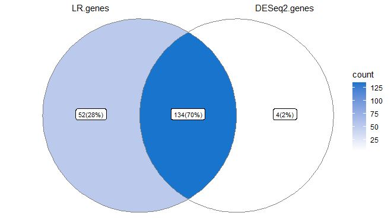
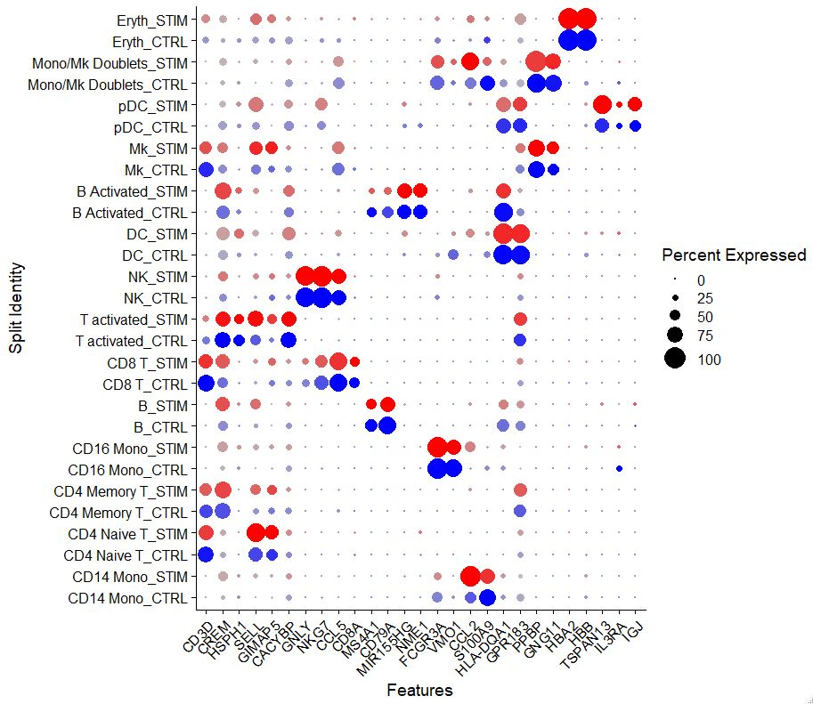
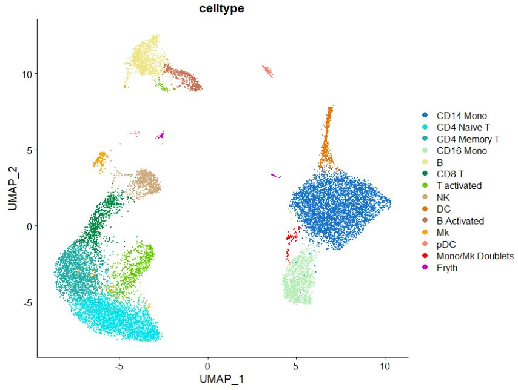
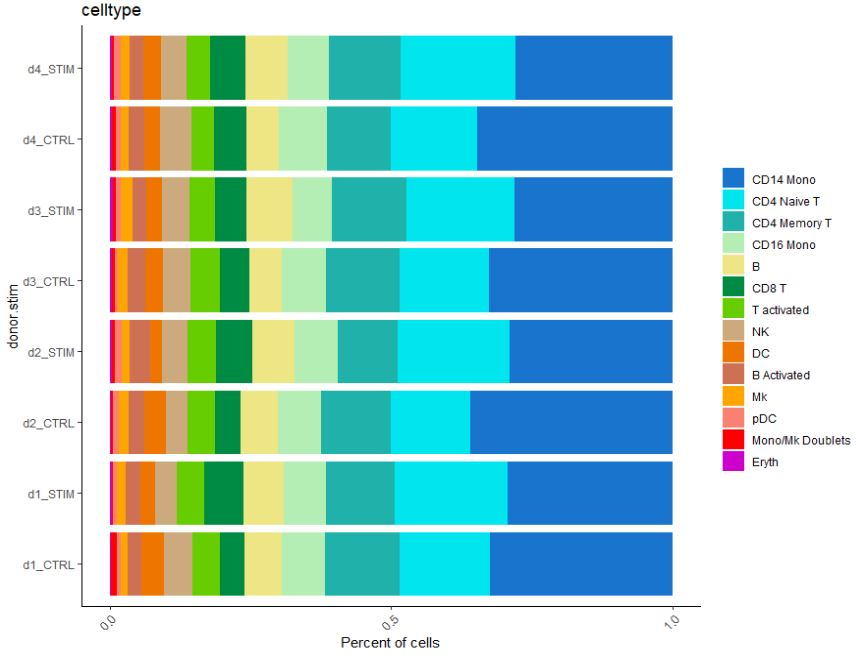
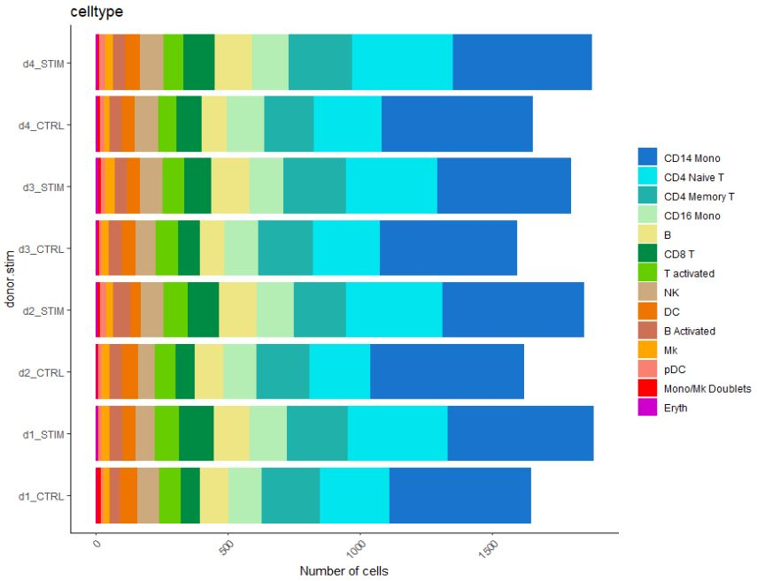

## Visualization
```r
# Lets look at genes in a venn diagram'
LR.genes <- rownames(b.interferon.response)
DESeq2.genes <- rownames(b.interferon.response.aggr)

# Make a list
x <- list("LR.genes" = LR.genes, "DESeq2.genes" = DESeq2.genes)

# Make a Venn object
venn <- Venn(x)
data <- process_data(venn)
ggplot() +
  # 1. region count layer
  geom_sf(aes(fill = count), data = venn_region(data)) +
  # 2. set edge layer
  geom_sf(aes(color = name), data = venn_setedge(data), show.legend = TRUE, size = 2) +
  # 3. set label layer
  geom_sf_text(aes(label = name), data = venn_setlabel(data)) +
  # 4. region label layer
  geom_sf_label(aes(label = paste0(count, "(", scales::percent(count/sum(count), accuracy = 2), ")")), 
                data = venn_region(data),
                size = 3) +
  scale_fill_gradient(low = "white", high = "dodgerblue3") + # change color based on celltype
  # scale_color_manual(values = c("bmvsbf" = "black",
  #                               "mvsf" ="black", 
  #                               "wmvswf" = 'black'),
  # scale_color_manual(values = c("beta_m" = "black",
  #                               "beta_f" ="black",
  #                               "alpha_m" = 'black',
  #                               "alpha_f" = 'black')) +
  scale_color_manual(values = c("LR" = "black",
                                "DESeq2" ="black"),
                     labels = c('D' = 'D = bdiv_human')) +
  theme_void()
#OUTPUT
```


```r
# Note how 70% of genes overlap, but who are they?
# Look at all sets of genes forming overlaps
# https://github.com/yanlinlin82/ggvenn/issues/21
mylist <- data@region[["item"]]
names(mylist)
```
```r
#OUTPUT
NULL
```
```r
names(mylist) <- data@region[["name"]]
mylist
```
```r
#OUTPUT
$LR.genes
  [1] "RSAD2"    "OASL"     "PML"      "ETV7"     "DHX58"    "STAT2"    "DDX60"    "DEK"     
  [9] "ZBP1"     "ZNFX1"    "GSDMD"    "MTHFD2"   "HSP90AA1" "ELF1"     "B3GNT2"   "NDUFA9"  
 [17] "LACTB"    "AP3B1"    "DTX3L"    "TMEM140"  "GBP7"     "GLRX"     "SP140"    "TMX1"    
 [25] "BAG1"     "TAP2.1"   "ZNF267"   "CNDP2"    "STAP1"    "CD53"     "HIF1A"    "MYCBP2"  
 [33] "CHI3L2"   "GNB4"     "SYNE2"    "RARRES3"  "GPBP1"    "SNX6"     "CTSS"     "TANK"    
 [41] "IDH3A"    "SOD2"     "MCL1"     "CAST"     "HLA-F"    "EVL"      "RNASEH2B" "UBE2F"   
 [49] "ANXA2R"   "IRF2"     "SQRDL"    "TSPAN13"
$DESeq2.genes
[1] "HLA-B" "H3F3B" "HLA-C" "LAMP3"
$LR.genes..DESeq2.genes
  [1] "ISG15"     "ISG20"     "IFIT3"     "IFI6"      "IFIT1"     "MX1"       "TNFSF10"   "LY6E"     
  [9] "IFIT2"     "B2M"       "CXCL10"    "PLSCR1"    "IRF7"      "HERC5"     "UBE2L6"    "IFI44L"   
 [17] "EPSTI1"    "OAS1"      "GBP1"      "IFITM2"    "SAMD9L"    "NT5C3A"    "IFI35"     "PSMB9"    
 [25] "MX2"       "DYNLT1"    "BST2"      "IFITM3"    "CMPK2"     "SAT1"      "EIF2AK2"   "PPM1K"    
 [33] "GBP4"      "DDX58"     "PSMA2.1"   "LAP3"      "SAMD9"     "XAF1"      "IFI16"     "COX5A"    
 [41] "SOCS1"     "MYL12A"    "SP110"     "PARP14"    "PSME2"     "TMSB10"    "CHST12"    "FBXO6"    
 [49] "MT2A"      "PLAC8"     "TRIM22"    "DRAP1"     "SUB1"      "TNFSF13B"  "NMI"       "XRN1"     
 [57] "NEXN"      "RBCK1"     "CLEC2D"    "MNDA"      "RNF213"    "IFI44"     "GBP5"      "NPC2"     
 [65] "STAT1"     "WARS"      "OAS2"      "SELL"      "TAP1"      "DDX60L"    "IRF8"      "OAS3"     
 [73] "RTCB"      "IFITM1"    "KIAA0040"  "CXCL11"    "CARD16"    "PSMA4"     "DNAJA1"    "IFIH1"    
 [81] "TYMP"      "HLA-E"     "LGALS9"    "NUB1"      "C19orf66"  "GBP2"      "PSMB8"     "GNG5"     
 [89] "HAPLN3"    "PMAIP1"    "IFIT5"     "PARP9"     "CD38"      "GMPR"      "C5orf56"   "EAF2"     
 [97] "HERC6"     "CD48"      "RTP4"      "RABGAP1L"  "USP30-AS1" "TREX1"     "IGFBP4"    "INPP1"    
[105] "CCL8"      "CREM"      "CD164"     "CLIC1"     "APOL6"     "CCL2"      "SMCHD1"    "ODF2L"    
[113] "EHD4"      "NAPA"      "SP100"     "PHF11"     "FAM46A"    "PNPT1"     "ADAR"      "POMP"     
[121] "UNC93B1"   "DCK"       "IRF1"      "CCR7"      "TMEM123"   "CASP4"     "HSH2D"     "SLFN5"    
[129] "CFLAR"     "CASP1"     "VAMP5"     "PSME1"     "XBP1"      "MRPL44" 
```
```r
# Visualization via dotplot
Idents(pbmc) <- factor(Idents(pbmc), levels = c("Mono/Mk Doublets", "pDC", "Eryth", 
                                                "Mk", "DC", "CD14 Mono", "CD16 Mono", 
                                                "B Activated", "B", "CD8 T", "NK", "T activated",
                                                "CD4 Naive T", "CD4 Memory T"))
markers.to.plot <- c("CD3D", "CREM", "HSPH1", "SELL", "GIMAP5", "CACYBP", "GNLY", "NKG7", "CCL5",
                     "CD8A", "MS4A1", "CD79A", "MIR155HG", "NME1", "FCGR3A", "VMO1", "CCL2", "S100A9", "HLA-DQA1",
                     "GPR183", "PPBP", "GNG11", "HBA2", "HBB", "TSPAN13", "IL3RA", "IGJ")
Idents(pbmc) <- "celltype"
DotPlot(pbmc, features = markers.to.plot, cols = c("blue", "red"), dot.scale = 8, split.by = "stim") +
  RotatedAxis()
#OUTPUT
```


```r
# Change colors on UMAP
DimPlot(pbmc, #switch here to plot
        #split.by = "Diabetes Status", 
        group.by = "celltype", 
        label = FALSE, 
        ncol = 1, 
        raster = FALSE,
        pt.size = 0.05,
        cols = c("dodgerblue3",      
                 "turquoise2",       
                 "lightseagreen",    
                 "darkseagreen2",    
                 "khaki2",            
                 "springgreen4",     
                 "chartreuse3",      
                 "burlywood3",       
                 "darkorange2",      
                 "salmon3",          
                 "orange",           
                 "salmon",           
                 "red",              
                 "magenta3",         
                 "orchid1",          
                 "red4",             
                 "grey30"            
        )
)
#OUTPUT
```


```r
# We can also look at cellular number across various cell types
pbmc$donor.stim <- paste(pbmc$donor, pbmc$stim, sep = "_")
table(pbmc$donor.stim)
```
```r
#OUTPUT

     B Activated_CTRL      B Activated_STIM                B_CTRL                B_STIM        CD14 Mono_CTRL 
                  183                   207                   405                   565                  2209 
       CD14 Mono_STIM        CD16 Mono_CTRL        CD16 Mono_STIM     CD4 Memory T_CTRL     CD4 Memory T_STIM 
                 2114                   518                   546                   813                   903 
     CD4 Naive T_CTRL      CD4 Naive T_STIM            CD8 T_CTRL            CD8 T_STIM               DC_CTRL 
                 1003                  1475                   320                   466                   226 
              DC_STIM            Eryth_CTRL            Eryth_STIM               Mk_CTRL               Mk_STIM 
                  194                    22                    33                    98                   122 
Mono/Mk Doublets_CTRL Mono/Mk Doublets_STIM               NK_CTRL               NK_STIM              pDC_CTRL 
                   42                    28                   312                   333                    51 
             pDC_STIM      T activated_CTRL      T activated_STIM 
                   77                   315                   343
```
```r
# Lets make a bar plot of cellular proportion
dittoBarPlot(pbmc, "celltype", 
             retain.factor.levels = TRUE,
             scale = "percent",
             color.panel = c("dodgerblue3",      
                             "turquoise2",       
                             "lightseagreen",   
                             "darkseagreen2",   
                             "khaki2",           
                             "springgreen4",     
                             "chartreuse3",      
                             "burlywood3",      
                             "darkorange2",      
                             "salmon3",         
                             "orange",           
                             "salmon",           
                             "red",              
                             "magenta3",         
                             "orchid1",          
                             "red4",             
                             "grey30"),          
             group.by = "donor.stim") + coord_flip()
#OUTPUT
```

```r
# Or even cellular number
dittoBarPlot(pbmc, "celltype", 
             retain.factor.levels = TRUE,
             scale = "count",
             color.panel = c("dodgerblue3",      
                             "turquoise2",       
                             "lightseagreen",   
                             "darkseagreen2",   
                             "khaki2",           
                             "springgreen4",     
                             "chartreuse3",      
                             "burlywood3",      
                             "darkorange2",      
                             "salmon3",         
                             "orange",           
                             "salmon",           
                             "red",              
                             "magenta3",         
                             "orchid1",          
                             "red4",             
                             "grey30"),          
             group.by = "donor.stim") + coord_flip()
#OUTPUT
```


----

[Just the Docs]: https://just-the-docs.github.io/just-the-docs/
[GitHub Pages]: https://docs.github.com/en/pages
[README]: https://github.com/just-the-docs/just-the-docs-template/blob/main/README.md
[Jekyll]: https://jekyllrb.com
[GitHub Pages / Actions workflow]: https://github.blog/changelog/2022-07-27-github-pages-custom-github-actions-workflows-beta/
[use this template]: https://github.com/just-the-docs/just-the-docs-template/generate
