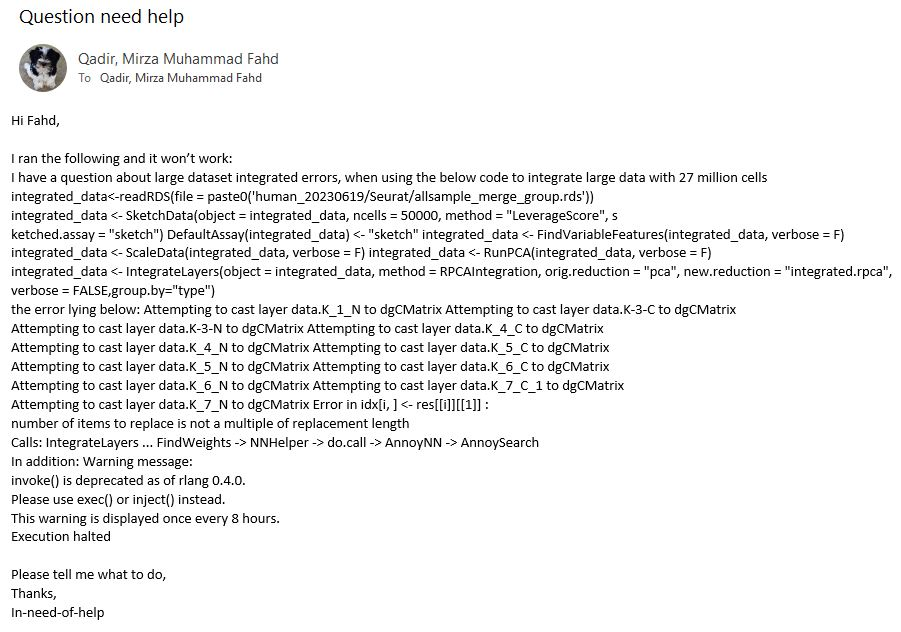
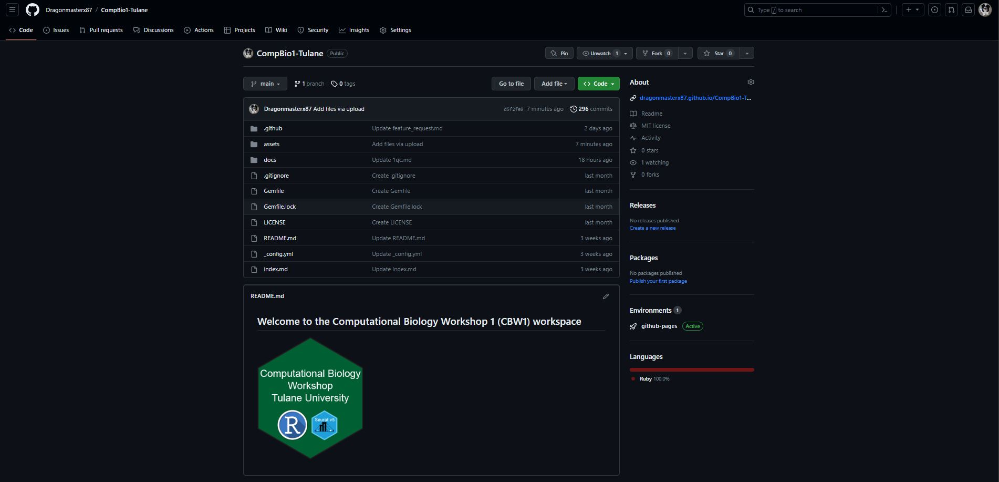
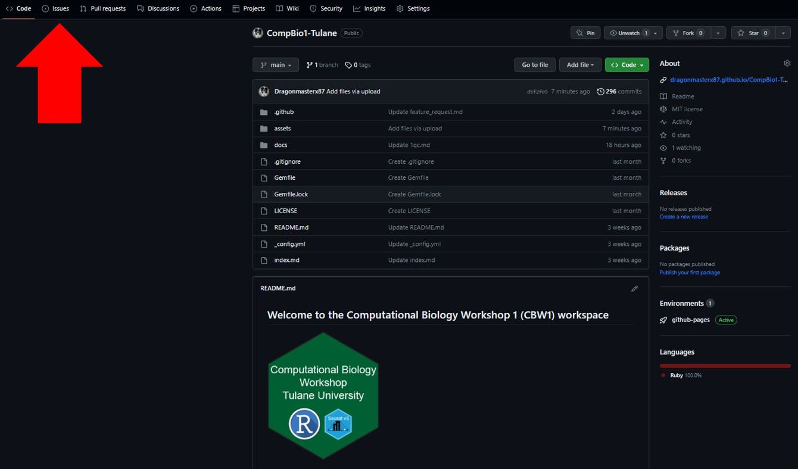

## Reprex: REPRoducible EXample
There will be many times in your journey to learn computational techniques where you will be faced with problems that you don't know how to solve. The next logical step would be to ask for help. So the question is how can this be done?

Well for starters if you have questions related to this course you can directly ask the instructor for help with questions and they will help whenever they have time. So, in order to ask for help the first thing that comes to mind is to send an email to the instructor, something like this:

Now, imagine someone spending time just figuring out what it is you wanted to do, and the problems you were faced with. Right now, I have no idea what packages you have loaded, what you are trying to achieve, and what steps you have taken so far. Not to mention the readability of code! In order to simplify asking a question, we will use the code-sharing platform GitHub. GitHub is a platform and cloud-based service for software development and version control of developer code using Git, allowing developers to store and manage their code. It provides the distributed version control of Git plus access control, bug tracking, software feature requests, task management, and continuous integration. It's free and open source and anyone can make an account on it. So let's head there and make an account use this link to take you to [GitHub](https://github.com/).

Once you have made an account, navigate to the GitHub page of this course which you can find [here](https://github.com/Dragonmasterx87/CompBio1-Tulane). This is what you should see:

Now that you are here, let's navigate to the issues tab. This is where you can ask questions that you are facing with the coding outlined in the course. Once you ask a question here, the instructor gets an email notification that someone has asked a question and then addresses it when they have time. Why are we asking questions in such a complicated manner? Well, GitHub allows you to use its flavoured markdown, which enables the user to format code in a more aesthetically organized manner making it easy to troubleshoot and address quickly. Read more about it [here](https://docs.github.com/en/get-started/writing-on-github/getting-started-with-writing-and-formatting-on-github). The issues tab is towards the upper left corner of the screen, as outlined in the image below:

----

[Just the Docs]: https://just-the-docs.github.io/just-the-docs/
[GitHub Pages]: https://docs.github.com/en/pages
[README]: https://github.com/just-the-docs/just-the-docs-template/blob/main/README.md
[Jekyll]: https://jekyllrb.com
[GitHub Pages / Actions workflow]: https://github.blog/changelog/2022-07-27-github-pages-custom-github-actions-workflows-beta/
[use this template]: https://github.com/just-the-docs/just-the-docs-template/generate
