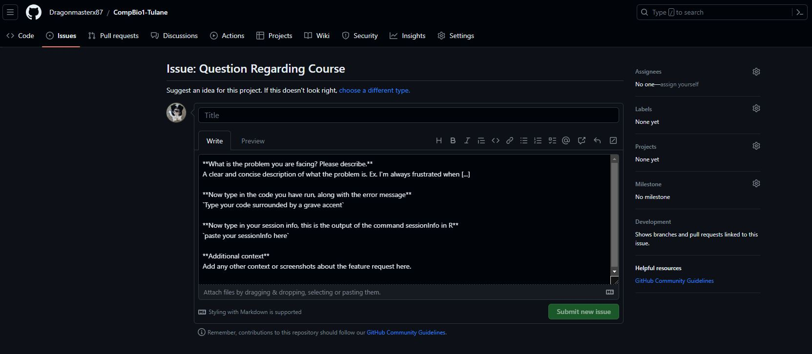

## Reprex: REPRoducible EXample
There will be many times in your journey to learn computational techniques where you will be faced with problems that you don't know how to solve. The next logical step would be to ask for help. So the question is how can this be done?

Well for starters if you have questions related to this course you can directly ask the instructor for help with questions and they will help whenever they have time. So, in order to ask for help the first thing that comes to mind is to send an email to the instructor, something like this:

Now, imagine someone spending time just figuring out what it is you wanted to do, and the problems you were faced with. Right now, I have no idea what packages you have loaded, what you are trying to achieve, and what steps you have taken so far. Not to mention the readability of code! In order to simplify asking a question, we will use the code-sharing platform GitHub. GitHub is a platform and cloud-based service for software development and version control of developer code using Git, allowing developers to store and manage their code. It provides the distributed version control of Git plus access control, bug tracking, software feature requests, task management, and continuous integration. It's free and open source and anyone can make an account on it. So let's head there and make an account use this link to take you to [GitHub](https://github.com/).

Once you have made an account, navigate to the GitHub page of this course which you can find [here](https://github.com/Dragonmasterx87/CompBio1-Tulane). This is what you should see:

Now that you are here, let's navigate to the issues tab. This is where you can ask questions that you are facing with the coding outlined in the course. Once you ask a question here, the instructor gets an email notification that someone has asked a question and then addresses it when they have time. Why are we asking questions in such a complicated manner? Well, GitHub allows you to use its flavored markdown, which enables the user to format code in a more aesthetically organized manner making it easy to troubleshoot and address quickly. Read more about it [here](https://docs.github.com/en/get-started/writing-on-github/getting-started-with-writing-and-formatting-on-github). The issues tab is towards the upper left corner of the screen, as outlined in the image below:

Once we are in the issues tab, we can now very easily generate a question, by first clicking on "new issue" and then "get started" green-colored tabs. This opens up a pane that allows that should look like this:

Now in the tab above, add the title to the question you want to ask about. Try to be concise yet cover the gist of the problem you are facing, some examples are "problems running PCA", "running dimplot doesn't generate an output plot", and "harmony objective function won't converge". The next step is to add a short description of what you have been doing and the problem you have faced (replace the pre-existing text with your own), there's no need to add code here, just a verbal description describing your problem. In the next section, you should add your code. Surround your code using the grave accent ` this allows the code to be formatted in a manner allowing it to be formatted in a manner that makes it more readable. Now add your entire session info and also surround it with the grave accent. Once you have completed this process click on Preview and see if everything looks appropriate, if it does, the final step is to click on the wheel on the right side that says Label and select an appropriate label such as bug, documentation, etc. Finally, click on the green "submit new issue" button and you are good to go! If you realise after positing a problem that you made a mistake, don't worry you can edit your comment pretty easily, by clicking on the edit tab.

Although this exercise may seem pointless to you now, almost 90% of coders use this method to troubleshoot and help others in their free time. So learning how to make a good reprex is essential if you are interested in anyone getting back and helping you in their free time. This same method can be used when you have advanced questions for the developers of other packages. For example, the Seurat GitHub has its own issues tab where thousands of issues can be found and many people attempt to answer them in their free time, not just the developers!

To read more about reprex check out these websites:
Reprex by [EconomiCurtis](https://community.rstudio.com/t/faq-whats-a-reproducible-example-reprex-and-how-do-i-create-one/5219)
Reprex [blogpost UV](https://data.library.virginia.edu/ask-better-code-questions-and-get-better-answers-with-reprex/)

Now the last piece of advice regarding questions is to google it! There is a very large probability that the question you are facing has been someone else's problem too, and they have more than likely done the hard work and asked before you have! Always go to the "issues" tab in GitHub and search for your problem first, but if you can't seem to find it just google your question, more times than not, you will find a solution online. Othwersie great places to ask for help are the GitHub issues tabs for packages, [stack overflow](https://stackoverflow.com/), and [biostars](https://www.biostars.org/)

----

[Just the Docs]: https://just-the-docs.github.io/just-the-docs/
[GitHub Pages]: https://docs.github.com/en/pages
[README]: https://github.com/just-the-docs/just-the-docs-template/blob/main/README.md
[Jekyll]: https://jekyllrb.com
[GitHub Pages / Actions workflow]: https://github.blog/changelog/2022-07-27-github-pages-custom-github-actions-workflows-beta/
[use this template]: https://github.com/just-the-docs/just-the-docs-template/generate
